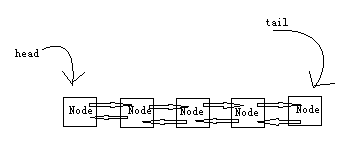
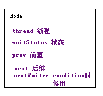
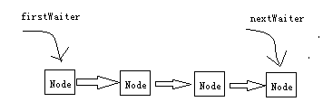
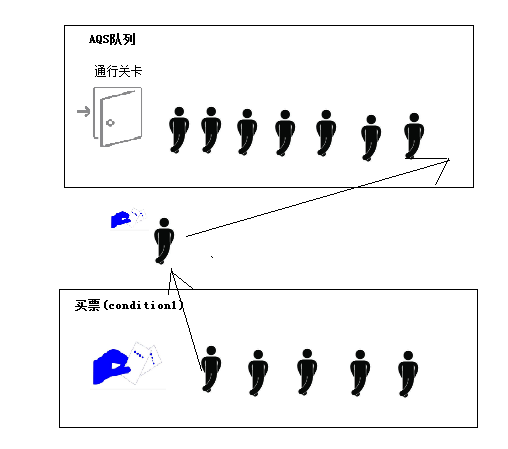

#### 结构：

一个节点是一个等待线程。nextWaiter是Condition等待队列用的的链表指针，AQS有个内部类ConditionObject，结构是这样的：

##### 跟condition的协作：

newConditon就创建一个链表，然后线程addConditionWaiter，把自己包成node插入到condition，如果遇到await,就从condition队列移到AQS队列，等待唤醒。

可以有多个condition

唉暂时不想写了有空再写吧。