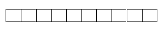
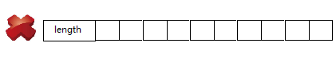

#### 结构：


非同步
#### 元数据：
Object[] **elementData**
int **size**

#### 辅助属性： 
**EMPTY_ELEMENTDATA** = {} 
创建空数组，elementData的值

**DEFAULT_CAPACITY** = 10 
默认数组大小

**DEFAULTCAPACITY_EMPTY_ELEMENTDATA** = {}
使用默认大小创建数组，elementData的值

**MAX_ARRAY_SIZE** = Integer.MAX_VALUE - 8
elementData最大的元素个数

1. 为什么DEFAULTCAPACITY_EMPTY_ELEMENTDATA跟EMPTY_ELEMENTDATA一样等于{}，有什么区别？

   一个是默认大小数组，一个是空数组，看起来都是{}，确实很让人误会，之所以默认大小组初始化的时候也是{}是因为arrayList用懒加载。等真的有数据进来的时候才会开始初始化默认数组。 虽然都是{},但是不同的对象所以引用不一样。
   

*    区分空数组和默认数组的方法:

   `if(elementData == DEFAULTCAPACITY_EMPTY_ELEMENTDATA)`
   

*    初始化默认数组(下面整理过的代码):

   
```java
     public boolean add(E e) {
         if (elementData == DEFAULTCAPACITY_EMPTY_ELEMENTDATA 
         && (size + 1) < DEFAULT_CAPACITY) {
             elementData = Arrays.copyOf(elementData, DEFAULT_CAPACITY);
        }

        elementData[size++] = e;
        return true;
    }
```
   
2. 为什么MAX_ARRAY_SIZE = Integer.MAX_VALUE - 8，要减去8， 一开始我以为是因为存了长度。


 但想一下好像不对，数组是元素是指针，32位系统指针32位，64位系统指针64位， 那length不就是大于等于8*32位了吗，太大了吧。
 后来查了一些资料,我觉觉得比较合理的解释是,数组也是对象，要存对象头，对象头占32个字节或者64个字节，取决于操作系统位数。8 *  32 （或者4）bit  = 8 * 4（或者8） byte = 32字节(或64字节)。
 
源码对属性的说明也有类似的：
```java
    /**
     * The maximum size of array to allocate.
     * Some VMs reserve some header words in an array.
     * Attempts to allocate larger arrays may result in
     * OutOfMemoryError: Requested array size exceeds VM limit
     */
    private static final int MAX_ARRAY_SIZE = Integer.MAX_VALUE - 8;
```
   header words
   
至于为什么数组对象大小不能超过    Integer.MAX_VALUE  * 操作系统位数的字节数，可能是jvm的某个规定，目前我还没有查到这里，以后看到jvm这部分规定可能才会完全确定下来。
#### 用户动作：
**基础操作：**
get 
set
add 2
remove 3 ： fastRemove

**批量操作：**
addAll 2
removeAll
toArray 2
replaceAll
retainAll 

**增强操作：**
contains
subList 获取子列表
forEach 1.8之后加入了函数参数，把每个元素执行指定的函数
removeIf 
sort
indexOf
lastIndexOf

**管理操作：**
trimToSize 数组容量一般都会比实际元素个数要多，这里把数组缩减到跟元素一样
ensureCapacity 确保容量满足一定值
size
isEmpty  
clone  
clear 把元素清掉   
 
 
#####  遍历：
iterator
listIterator 相对于普通序列器多了向前操作。
spliterator 这个我还没有看1.8之后新加进来的，貌似是用来并发遍历的


#### 内部动作：
elementData 类型转换
removeRange
rangeCheck
rangeCheckForAdd 
batchRemove 
subListRangeCheck 

##### 扩容：
ensureCapacity ：确保容量达标，做初始化检查
calculateCapacity ：计算最小需要的容量
ensureCapacityInternal ： 确保容量达标
ensureExplicitCapacity ：确保容量达标，不够就扩容
grow ： 扩展容量
扩容是这几个函数相互调用而已，调来调去有点乱, 下面把这几个函数裁剪进一段代码。

**扩容过程：**
下面是整理过的代码（从源码裁剪）：
```java
    public boolean add(E e) {
        int minLength = size + 1;
        if (elementData == DEFAULTCAPACITY_EMPTY_ELEMENTDATA) {
            minLength = Math.max(DEFAULT_CAPACITY, minCapacity);
        }
        
        if (minCapacity - elementData.length > 0)
             grow(minCapacity);

        elementData[size++] = e;
        return true;
    }
```
```java
    private void grow(int minCapacity) {
        // overflow-conscious code
        int oldCapacity = elementData.length;
        int newCapacity = oldCapacity + (oldCapacity >> 1);
        if (newCapacity - minCapacity < 0)
            newCapacity = minCapacity;
        if (newCapacity - MAX_ARRAY_SIZE > 0)
            newCapacity = hugeCapacity(minCapacity);
        // minCapacity is usually close to size, so this is a win:
        elementData = Arrays.copyOf(elementData, newCapacity);
    }
```
minCapacity是添加元素成功需要的最小容量，除了最后那句copy之外，上面一大堆做的事情是:

1. 计算扩容以后的新容量大约等于newCapacity = 1.5倍旧容量
2. 看下newCapacity有没有满足minCapacity
3. 看下newCapacity有没有操作最大容量

##### 序列化：
writeObject
readObject


##### 异常处理：
outOfBoundsMsg：越界处理
hugeCapacity ：容量太大的处理


