读了部分源码，里面有很多常用到的算法，或者一些属性知识点，我把我留意到的理解了的部分写出来，还没有办法全部完全理解的部分，后面有时间看会慢慢补充。也可能会有错漏的地方，后面多看多理解以后再慢慢修改。

##### 1. r & (length - 1) = r % length
   代码里面用到大量的 r & (length - 1)这种运算，因为为了方便运算，设计者把length设计成2的n次方，举个例子，length = 8= 1000，然后减去1就变成0111。任何数字和这串二进制做与运算都会剩下后面三位。相当于对8取余数。
   
   假设 ：
         r = 11110101110，length = 8;
         r = 11110101 <<< 3 + 110 
         r = 11110101 * 8 + 1110 
         
   可以得出，r取任意整数都可以写成这种形式:
         r = n * 8 + t  (其中n, t都是整数。)
        
    如果length不等于8，等于2的x次方同理可以得出
    
    r = n <<< x + t
    r = n * length + t
    
    r & (length -1) = t = r % length
    
    因为 length - 1 是一个与t相同二进制位，而且全是1的值，高于t的位数做与运算都为0了。
          
##### 2. ForkJoinPool的总体数据结构
 
   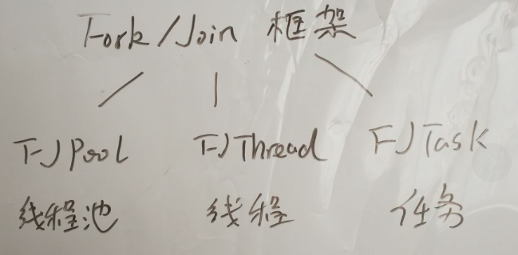 
   先说一下基本概念，Fork/Join框架，这个框架主要有三个基础组件组成的。
   
   ForkJoinPool里面：
   
   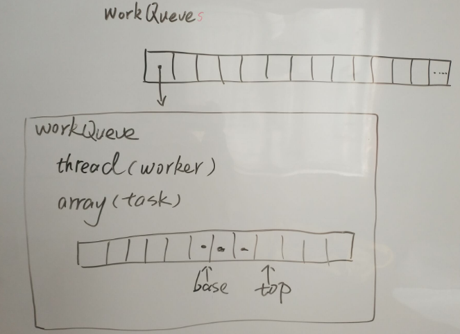 
   
   里面有个一任务数组workQueues,每个元素是一个workQueue，每个workQueue下面有一个线程（共享模式的时候没有）, 还有一个array任务数组，你可以想象成workQueues里面存了很多线程，然后线程有自己的任务队列，共享模式下的任务因为是共享的，没有专门的线程。然后array队列里面有两个指标base,top, base指这个array数组的第一个元素，top指的是最后一个元素。
   
##### 3. 线程运行过程
   
   下面用JDK里面RecurisiveTask的例子，讲一个简化的流程：
   ```java
class Fibonacci extends RecursiveTask<Integer> {
    final int n;
    Fibonacci(int n) { this.n = n; }
    Integer compute() {
      if (n <= 1)
        return n;
      Fibonacci f1 = new Fibonacci(n - 1);
      f1.fork();
      Fibonacci f2 = new Fibonacci(n - 2);
      return f2.compute() + f1.join();
    }
  }}
``` 
先讲一下这个RecurisiveTask我的理解，看名字Recurisive， Task,这是一个任务类，然后Recurisive是递归的意思，所以这是一个递归任务队列，设计出来是给你用来做有递归特性的任务设计的。因为task嘛，它有一个抽象方法类于exec, 用来执行任务，一般是给工作线程调用的。这个方法一般只执行一次。那你不可能exec里面再调用exec这就非常奇怪了。RecurisiveTask里面的代码是这样的：

```java
 protected abstract V compute();

    protected final boolean exec() {
        result = compute();
        return true;
    }
```
它帮你把exec实现了，里面调用了抽象方法compute,那如果你要做递归，你直接实现compute方法的时候可以再调用compute方法，因为线程不会直接调用这个compute方法的。这样子不会破坏原先的设计的情况下你可以做一些递归的设计。

这是用来计算做斐波纳契数列的，就是存在f(x) = f(x -1) + f(x - 2)这样类似的函数关系的问题。下面把代码抽象成伪代码：
```java
compute(){
   task1 
   task1.fork
   task2 
   task2.compute + task1.join;
}
```  
fork操作会把任务入array队列。join操作是如果当前操作是array的最靠近top的元素，那就取出来调用exec,也就是compute。后面说明task1用t1来代表，然后下面分析一下这个函数的执行过程。
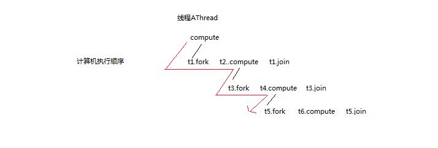 

上面是计算机从左往右的执行顺序。
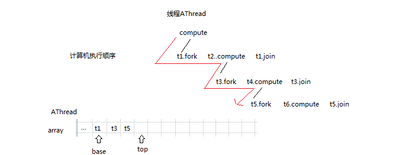 

线程A在执行fork以后这些任务被放进了队列，然后t6.compute没有fork方法了,执行完t6.compute，回去看自己私有队列栈顶元素t5，pop出来做运算。

在A很忙的时候，这时候有个很闲的家伙叫线程B，它自己的队列已经空了。

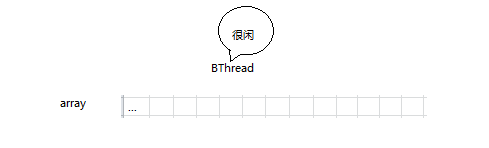 


这时候它寻思着要帮别人做点事情，找到了线程A的队列。打算偷走一些工作自己做。
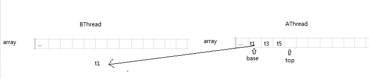 

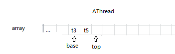 

挪一下base指针，取走t1任务。

然后线程B就按照之前A的工作方式去处理任务t1,然后如果里面有fork就入自己的队列。
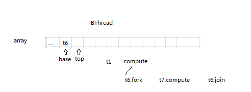 


这时候万一A已经把事情做完了，然后它要执行t1.join的时候发现任务没完成，然后自己队列又空了，肯定是有人拿走了我的任务，看一下原来是线程B.

这时候线程A就跑去B那里帮B把任务做完，也是把任务偷回来。
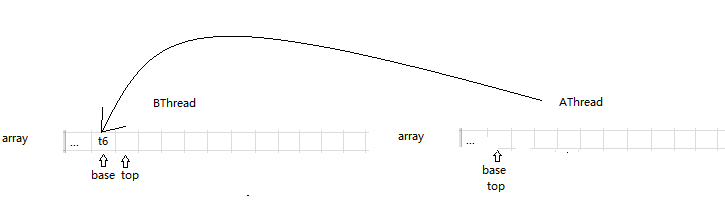 


就是说线程很闲，只要线程池里面有任务，线程都不会把自己挂起来，这就充分利用cpu了，然后别人是从base方向偷任务的，线程所有者是从top那边取任务的，所以top那边不需要加锁取任务。因为可以很多空闲线程去偷A的不同任务。所以base那边就要注意一下了。

这里有个疑问，为什么是  return f2.compute() + f1.join(); 而不是先fork 然后return f2.join f1.join呢。fork不会阻塞，join有可能(如果任务给人偷走还没有执行完就要等。)所以先尽快无阻塞地fork出很多任务来，让别的空闲线程可以帮忙处理多一点。一点。

##### 4. 属性
下面列出来部分属性，以及后面说明属性的运算与意义。打叉的是我自己没有理解到可以写出来的。
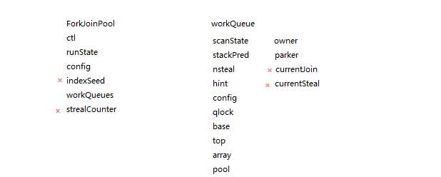 

* ctl 全局控制
 ctl是一个64位的数字，其实里面由四个字段组成，每个字段占16位
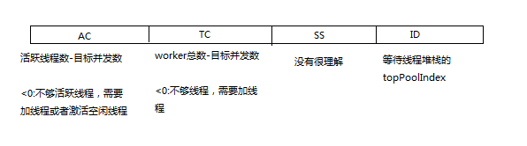 
 
 ID是空闲线程堆栈的top元素：每个workQueue有一个stackPred存的是上一个空闲线程的下标所以逻辑上可以形成一个堆栈，把空闲的串起来，需要激活多点线程的话从这里出队，不用创建：
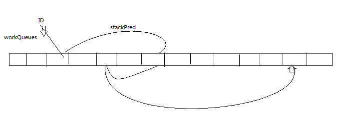 
 
AC:
常用和它一起运算的属性：
 

| 变量 |数值  |运算  |
| --- | --- | --- |
| AC_SHIFT |48  |AC <<AC_SHIFT 就是AC在CTL的位置  |
| AC_UNIT |0x0001L <<AC_SHIFT  |ctl + AC_UNIT等于AC加1  |
| AC_MASK| 0xffffL << AC_SHIFT  | ctl & AC_MASK就可以得到只有AC信息的ctl |


TC:
常用和它一起运算的属性：

| 变量 |数值  |运算  |
| --- | --- | --- |
| TC_SHIFT |32  | TC << TC_SHIFT 是TC在CTL的位置 |
| TC_UNIT |0x001L << TC_SHIFT  | ctl + TC_UNIT 等于TC加1 |
| TC_MASK | 0xffffL << AC_SHIFT | clt & TC_MASK 就可以得到只有TC 信息的ctl|
|ADD_WORKER|0x0001L << (TC_SHIFT + 15)|TC的符号位，如果ctl & 它不为0代表TC符号位不为0，代表负数，也就是x需要增加线程|

*  runState 运行状态
STARTED,STOP,SERMINATED,SHUNTDOWN

* config 线程池配置
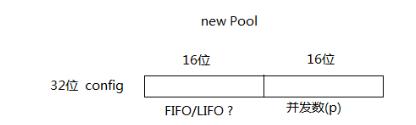 
 
...有空再写 

