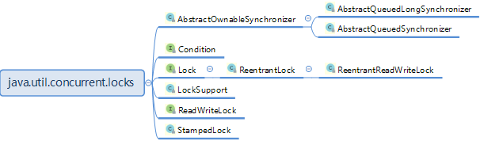
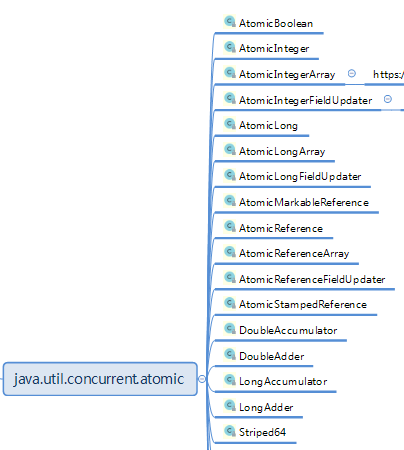
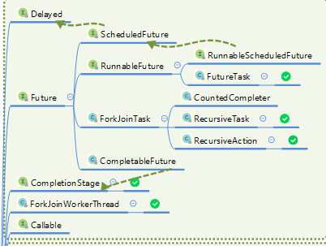
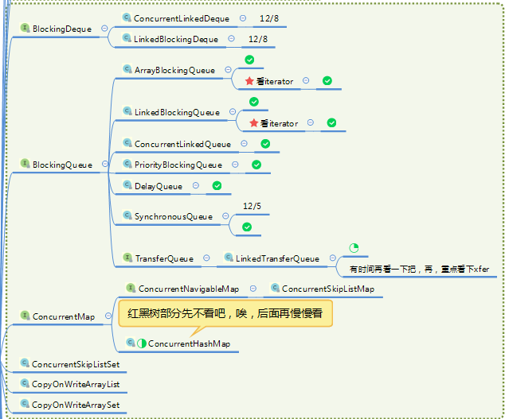
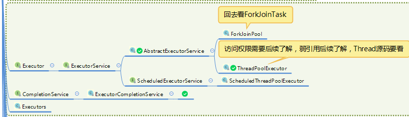
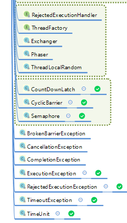

**并发包都会用到这个东西：**

sun.misc.Unsafe.getUnsafe()

这个工具是一些native方法，包括直接读内存，直接写内存，还有阻塞等的操作，所有的并发包都基于这个工具编程。

并发包三个大包，java.util.concurrent.locks，java.util.concurrent.atomic，java.util.concurrent

**java.util.concurrent.locks**

LockSupport提供底层的锁操作。AbstractQueuedSynchronizer简称AQS实现了阻塞队列，Condition跟AQS可以一起合作组成多条件锁。

**java.util.concurrent.atomic**
 

对boolean integer long reference等封装一些CAS操作。CAS是计算机底层支持的一些指令操作。还有一些类似volatile的读写操作。

**java.util.concurrent**

图好大，分开几截

还有一些散户

这个包里面是结构化并发工具。核心的有重量级的线程池系列，有Fork/Join框架，有阻塞队列各种，有Future框架，轻量级的有CountDownLatch、CyclicBarrier、Semaphore这几个同步工具, 后面选一些主题写。