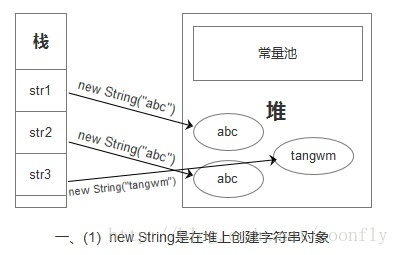
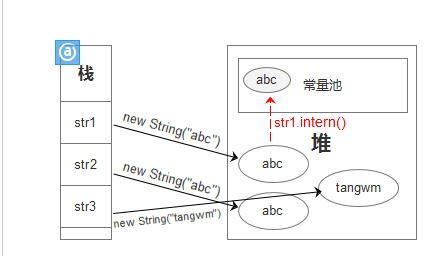
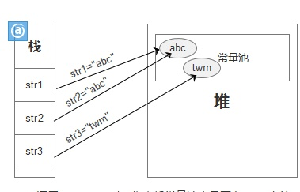

**创建String**
别这样
```java
String s = new String("stringette");
```
用这个代替
```java
String s = "stringette";
```

 

1. 如果是用new String创建的字符串，字符串是放在堆里面的
 

2. 当调用intern方法的时候，会做2种操作，第一种，如果常量池里面没有这个字符串的话，去常量池创建一个，并且返回这个字符串的引用。第二种，如果常量池有这个字符串的话，直接返回字符串在常量池的地址。
 


3. 如果String不是通过new来赋值的，而是直接用常量赋值的，编译器一开始就会把它放到常量池，而不会在运行时才让他生成并且放到堆里。

**不可变类优先使用静态工厂构建**
例如Boolean.valueOf(String)优先于构造器Boolean(String)

**重用可变但是不会变的对象**
```java
public class Person{
  private final Date birthDate;
  
  public boolean isBabyBoomer(){
    Calendar gmtCal = Calendar.getInstance(TimeZone.getTimeZone("GMT"));
    gmtCal.set(1946, Calender.JANUARY, 1, 0, 0, 0);
    Date boomStart = gmtCal.getTime();
    gmtCal.set(1965, Clendar.JANUARY, 1, 0, 0 ,0);
    Date boomEnd = gmtCal.getTime();
    return birthDate.compareTo(boomStart) >= 0 &&
             bitrhDate.compareTo(boomEnd) < 0;
  }
}
```
每次调用isBabyBoomer都会创建一个Calendar, 一个TimeZone，两个Date实例，这些事不必要的。下面优化

```java
class Person{
  private final Date birthDate;
  private static final Date BOOM_START;
  private static final Date BOOM_END;
  
  static{
    Calendar gmtCal = Calendar.getInstance(TimeZone.getTimeZone("GMT"));
    gmtCal.set(1946, Calendar.JANUARY, 1, 0, 0, 0);
    BOOM_START = gmtCal.getTime();
    getCal.set(1965, Calendar.JANUART, 1, 0, 0, 0);
    BOOM_END = gmtCal.getTime();
  }
  
  public boolean isBabyBoomer(){
     return birthDate.compareTo(BOOM_START) >= 0 && birtyDate.compareTo(BOON_END) < 0;
  }
}
```
改进后不会每次调用都创建一次那些对象。

**循环与自动装箱**
```java
public static void main(String[] args){
  Long sum = 0L;
  for(long i = 0; i < Integer.MAX_VALUE; i++){
      sum += i;
  }
  System.out.println(sum);
}
```

sum每次和i做加法要把i转换成Long对象，i++也一样啊，对比的时候也是啊，反复装箱拆箱，创建了很多没用的对象。


并不是说创建对象代价昂贵，尽量避免创建对象。相反小对象创建回收比较廉价，所以通过创建附加对象来简化代码。另外通过对象池避免创建对象不见得是好的，除非创建对象代码昂贵，比如说数据库连接池。对象池很容易让代码显得很乱，而且也多了额外内存占用。

所以说的是，应该重用对象的时候不要创建对象。
