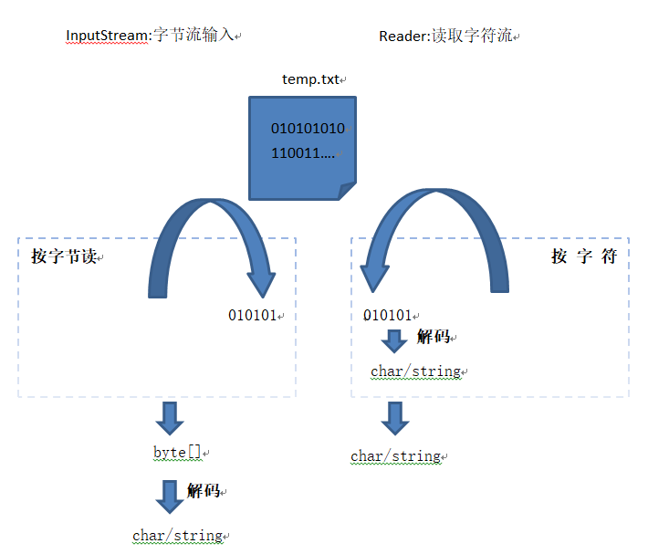
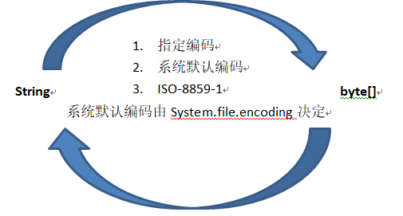
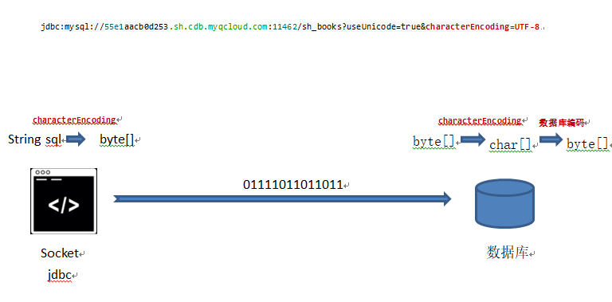

> 编码解码原理(乱码原由)

---

​     平时常常会遇到中文乱码，有时候很抓狂，不知道到底为什么乱码。下面整理一下会遇到编码解码的情况，以及它的逻辑（不一定全对，但可以参考一下），只有编码解码对称才能解决乱码问题。

     1. 常用的编码方式:

        ISO-8859-1、GB2312、GB18030、GBK、UTF-16、UTF-8、ASCII  ...

        产生乱码的原因是编码和解码选的不是同一种编码方式导致的。

     2. 编码解码

        编码解码一般的场景分为I/O, 内存，数据库，JavaWeb，下面给出各种场景的解码时刻。

        ### I/O

        

        分为两种读，一种是按照字节，另外一种是按照字符读取。

       ###      内存

​         

       ###    数据库

​     

      ### JavaWeb

