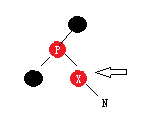
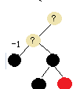

#### 结构：


红黑树部分： 

 
 虽然是树型结构，但是还保留next指针，可以跟普通Iterator一样遍历，所以Iterator的实现就不需要特别另外增加复杂度。
 
红黑树有序的，哈希表无序，所以会对比key的自然顺序，作为顺序

#### 设计

当链表长度超过某个数的时候会变成树，当树变小到某个数的时候会变回链表。但是变成树的前提是数组的容量不低于某个数。

**哈希表有几个关键属性，控制容量的:**

loadFactor : 负载因子，是一个百分比，代表哈希表空间不能超过百分之多少的满

threshold : 空间可放元素个数，就是 总容量 * loadFactor得出来的

**一些默认值：**

TREEIFY_THRESHOLD = 8 ：超过这个数量，链表变树

UNTREEIFY_THRESHOLD = 6 ： 小于等于这个数量，树变链表

MIN_TREEIFY_CAPACITY = 64 ： 要变成树，数组的容量不能低于这个

DEFAULT_INITIAL_CAPACITY = 1 << 4 ： 默认初始化数组容量

MAXIMUM_CAPACITY = 1 << 30 ： 数组最大容量不能大于等于这个数（已经负数了，符号位了）

DEFAULT_LOAD_FACTOR = 0.75f ： loadFactor默认值


#### 红黑树：

1. 节点是红色或者黑色
2. 根节点黑色
3. 两个红色节点不能相邻
4. 叶子节点，空节点是黑色
5. 任意节点到叶子节点经过的黑色节点数一样

对于平衡二叉树来说，因为左右子数高度差不超过1，所以搜索效率比较平均。但是要维持平衡二叉树，要求频繁去调整二叉树的结构来维持平衡二叉树的高度差不超过1.**红黑树允许高度差在一定范围内，既相对平衡又不会太严苛导致过于频繁调整树形结构。**

###### 高度差证明：
假设一个二叉树有以下这个部分（省略了不相关的部分）。左右的黑色节点数都是3。要想保持第5点，又想要高度差尽量大。在中间插入红色节点就行。


这样还能保持符合红黑树定义，但是允许高度差相对于平衡二叉树增大了。

    设单边黑色节点数x,在这里x = 3
    对于左子树，头尾都是黑色节点，所以红色节点数是 x - 1
    所以左边高度 红+黑= x + x - 1 = 2x -1
    高度差两边相减2x - 1 - x = x - 1 .
    所以左右高度差不会超过1倍。

###### 新增的都是红色节点：

1. 新增一个节点，根节点黑色, 空节点黑色，N也是黑色


2. 现在你要插入一个节点，是红色还是黑色呢，假设黑色，无论怎么插入都会破坏两边平衡，另一边会多出一个黑色。因为红黑树左右两边到树底黑色节点数本来就已经一样的，所以新增节点只能是红色。


###### 红黑树调整

**1. 插入**
如果插入的时候刚好父节点是红色，就要调整，因为不能两个相邻红色。

怎么办呢，如果父节点是红色，可以推导出父节点旁边肯定是黑色：

把父节点跟上面那个黑色换一下颜色，没有破坏平衡，就是不知道新的那个红节点会不会也是产生冲突，那就把指针上移，一直到上面没冲突，或者根节点，如果当前节点是根节点，直接变黑色，等于左右加了1，不会破坏平衡：

如果插入的是另一边呢：

那就旋转一下：

把指针指向p，就跟第一种情况一样了。


**2.删除**


要删除D,直接找个节点直接赋值给D,就省事了，这样D的子树不会受影响。要找比D大一点点又小于D右端的，按照箭头方向顺序找，找到最小的，然后把值赋给D，删除这个节点。


* 删除的是红色节点，不会打破平衡，直接删
* 删除的是黑色，打破平衡，就要放大来看删除后的树了，假设删除后是这样的（跟上面情况不太一样，不过可以互相转换的，所以后面列出各种可能）：


情况：
如果替补节点是根节点就平衡啦，所以不考虑替补节点是根节点，除了对称情况之外可以划分一下几种情况：


各种情况都是可以相互转换的

**情况1**. 如果替补节点是红色

直接红色变成黑色可以了


**情况2**. 如果替补节点是黑色，父亲另外一个子节点是红色  

可以推出

换颜色

旋转


跟**情况1**一样

**情况3.**

颜色换一下

变成**情况2**

**情况4**


父节点跟另外一边子节点换颜色

旋转


变色


**情况5**

换色

旋转


变成**情况2**

**所以实质上是只有情况1，情况2**

#### 扩容

因为代码有些不是特别好理解，所以把相关代码贴出来分析一下。 

```java
    public HashMap(int initialCapacity, float loadFactor) {
        if (initialCapacity < 0)
            throw new IllegalArgumentException("Illegal initial capacity: " +
                                               initialCapacity);
        if (initialCapacity > MAXIMUM_CAPACITY)
            initialCapacity = MAXIMUM_CAPACITY;
        if (loadFactor <= 0 || Float.isNaN(loadFactor))
            throw new IllegalArgumentException("Illegal load factor: " +
                                               loadFactor);
        this.loadFactor = loadFactor;
        this.threshold = tableSizeFor(initialCapacity);
    }
```
初始化的时候，这句话让我不是特别好理解

`this.threshold = tableSizeFor(initialCapacity);`

    threshold 是容量乘以loadFactor的结果，为什么这里直接把initialCapacity赋值给他呢。后来想一下，threshold存的才是实际容量。所以它直接赋值就不会对用户指定的容量打折。

    tableSizeFor返回一个2的整数次方的数，如果initialCapacity本来就等于2的整数次方了，就返回initialCapacity，不然就返回比它大一点的2的整数次方数。

```java
if (++size > threshold)    resize(); 
```
当size超过实际可容纳的阀值，就扩容。

```java
    final Node<K,V>[] resize() {
        Node<K,V>[] oldTab = table;
        int oldCap = (oldTab == null) ? 0 : oldTab.length;
        int oldThr = threshold;
        int newCap, newThr = 0;
       //如果数组已经初始化过了
       if (oldCap > 0) {
            if (oldCap >= MAXIMUM_CAPACITY) {
                threshold = Integer.MAX_VALUE;
                return oldTab;
            }
            else if ((newCap = oldCap << 1) < MAXIMUM_CAPACITY &&
                     oldCap >= DEFAULT_INITIAL_CAPACITY)
                newThr = oldThr << 1; // 扩容扩2倍
        }
        //如果数组没有初始化过，但是有设置threshold,那就是上面那个构造函数产生的效果
        else if (oldThr > 0) // 初始容量存在threshold上
            newCap = oldThr;
        //如果数组没有初始化过，而且threshold没有值，那就是默认值咯，用无参构造函数 
        else {               
            newCap = DEFAULT_INITIAL_CAPACITY;
            newThr = (int)(DEFAULT_LOAD_FACTOR * DEFAULT_INITIAL_CAPACITY);
        }
        
        //如果newThr等于0就算一下它的值，容量*负载因子，得出实际容量
        if (newThr == 0) {
            float ft = (float)newCap * loadFactor;
            newThr = (newCap < MAXIMUM_CAPACITY && ft < (float)MAXIMUM_CAPACITY ?
                      (int)ft : Integer.MAX_VALUE);
        }
        threshold = newThr;
        //用新的容量新建一个数组，用来做扩容后的数组
        @SuppressWarnings({"rawtypes","unchecked"})
            Node<K,V>[] newTab = (Node<K,V>[])new Node[newCap];
        table = newTab;
        //后面就是把旧的数组元素赋值到新的数组，当然不是直接赋值啦，重新做哈希运算
        if (oldTab != null) {
            for (int j = 0; j < oldCap; ++j) {
                Node<K,V> e;
                if ((e = oldTab[j]) != null) {
                    oldTab[j] = null;
                    //当前元素如果是没有链表的，没有树的，那就没碰撞过，直接放到新数组
                    if (e.next == null)
                        newTab[e.hash & (newCap - 1)] = e;
                    //如果当前数组元素有next而且是棵树
                    else if (e instanceof TreeNode)
                    //如果是树那就函数里面去把这棵树放到新表中。里面实质上跟普通链表
                    //差不多,因为之前说了，树节点是有保存next指针的，只不过就是如果数量
                    //达到阀值，就树形化，小于阀值就链表化而已 
                        ((TreeNode<K,V>)e).split(this, newTab, j, oldCap);
                    //如果是链表
                    else { 
                        Node<K,V> loHead = null, loTail = null;
                        Node<K,V> hiHead = null, hiTail = null;
                        Node<K,V> next;
                        //遍历链表把元素全部重新插入到新数组
                        do {
                            next = e.next;
                            //下面就是把链表元素分成2半，一些放在原先同个槽位，
                            //称之为头，一些放在原先槽位偏移oldCap的地方，称之为尾巴
                            //如果与oldCap &运算等于0放在尾巴，不然就放在头，其实你
                            //用生成随机数也是一样的，这里随便定了个划分标准而已
                            if ((e.hash & oldCap) == 0) {
                                if (loTail == null)
                                    loHead = e;
                                else
                                    loTail.next = e;
                                loTail = e;
                            }
                            else {
                                if (hiTail == null)
                                    hiHead = e;
                                else
                                    hiTail.next = e;
                                hiTail = e;
                            }
                        } while ((e = next) != null);
                        if (loTail != null) {
                            loTail.next = null;
                            newTab[j] = loHead;
                        }
                        if (hiTail != null) {
                            hiTail.next = null;
                            newTab[j + oldCap] = hiHead;
                        }
                    }
                }
            }
        }
        return newTab;
    }
```

**1. 为什么树重新插入的时候还要树形化或者链表化？操作的时候不是当链表操作的吧，操作完之后应该就是链表了吧？**

其实原先就是一棵树，结构也是树，虽然是链表，但是数据结构还是树，部分指针也乱指，所以达到阀值需要链表化。

**2. 那为什么要树形化，你不是说原先就是树结构了吗？**

是树结构，但是它变成一个单边的树了，不是红黑树

#### 链表树型化
就是链表的元素插入到红黑树而已

#### 树链表化
就是把树链表插入都到普通链表而已

#### entry,value,key的Iterator

这部分其实用的同一个Iterator,根据type给你返回entry,还是value，还是key
举个例子

``` java
    final class KeyIterator extends HashIterator
        implements Iterator<K> {
        public final K next() { return nextNode().key; }
    }
```

#### 比较难懂的代码

```java
    static final int tableSizeFor(int cap) {
        int n = cap - 1;
        n |= n >>> 1;
        n |= n >>> 2;
        n |= n >>> 4;
        n |= n >>> 8;
        n |= n >>> 16;
        return (n < 0) ? 1 : (n >= MAXIMUM_CAPACITY) ? MAXIMUM_CAPACITY : n + 1;
    }
```
这个函数的作用是返回一个2的整数次方的数，如果initialCapacity本来就等于2的整数次方了，就返回initialCapacity，不然就返回比它大一点的2的整数次方数。

不看cap - 1，先单纯看后面, 任何一个数只要不是0写成二进制都是这样的：

1xxxxxxxxxxxxxx

所以运算可以这样看:


实质上是吧1填满因为n是int 32位，所以最后移到16就能完全覆盖这个int.

cap - 1 如果cap是2的n次方，最后n+1就变回cap了，如果不是那n+1就是比cap大最小的那个2的n次方

#### 还没看完的东西

spIterator