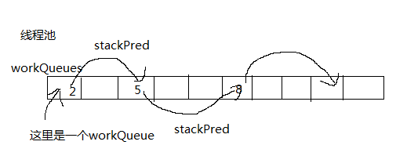
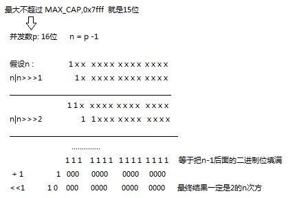
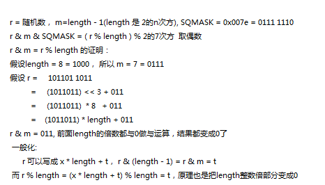
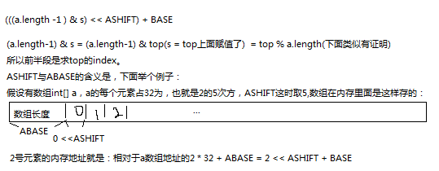
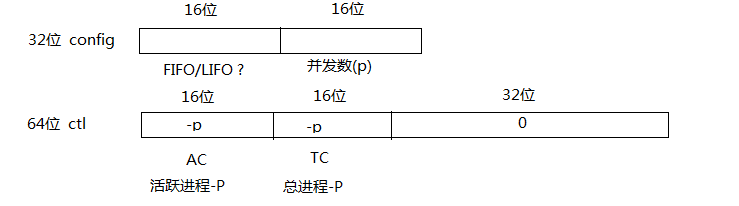

因为直译很拗口而且逻辑很反人类，所以有些地方在直译的基础上通过自己的理解转换了一下描述。然后有些地方时，我看不懂，不会翻，如果有翻译不当的地方，欢迎指正。还没写完，后面慢慢加。

```java

    package java.util.concurrent;

    import java.lang.Thread.UncaughtExceptionHandler;
    import java.util.ArrayList;
    import java.util.Arrays;
    import java.util.Collection;
    import java.util.Collections;
    import java.util.List;
    import java.util.concurrent.AbstractExecutorService;
    import java.util.concurrent.Callable;
    import java.util.concurrent.ExecutorService;
    import java.util.concurrent.Future;
    import java.util.concurrent.RejectedExecutionException;
    import java.util.concurrent.RunnableFuture;
    import java.util.concurrent.ThreadLocalRandom;
    import java.util.concurrent.TimeUnit;
    import java.util.concurrent.atomic.AtomicLong;
    import java.security.AccessControlContext;
    import java.security.ProtectionDomain;
    import java.security.Permissions;

    /**
     * 用于运行{@link ForkJoinTask}的{@link ExecutorService}。
     * {@code ForkJoinPool}提供了非{@ code ForkJoinTask}
     * 客户端提交的入口，以及管理和监控操作。
     *
     * {@code ForkJoinPool}与其他类型的{@link ExecutorService}
     * 的区别主要在于使用work-stealing算法：池中的所有线程都试
     * 图查找并执行线程池中不是自己创建的任务，也就是由其他活动
     * 线程创建的任务（如果不存在则阻塞worker(线程)）。 这种算法
     * 在大多数任务产生子任务时（如大多数{@code ForkJoinTask}）
     * ，和外部客户端向池提交许多小任务时，可是实现高效处理。 特
     * 别是在构造函数中将asyncMode设置为true时，
     * {@code ForkJoinPool}也可能适用于不需要join的event-style任务。
     *
     * 大多数应用程序适合使用静态{@link #commonPool()}。 如果
     * 不需要指定特定的线程池，可以直接使用静态的common pool
     * 来执行ForkJoinTask。 使用common pool一般以减少资源使
     * 用（其线程在不使用期间缓慢回收，并在后续使用时恢复）
     *
     * 对于需要单独或自定义线程池的应用程序，可以使用给定的目标并
     * 发级别构造{@code ForkJoinPool}; 默认情况下，等于可用cpu数。 
     * 线程池尝试通过动态添加，挂起或恢复内部工作线程来维护足够的
     * 活动（或可用）线程，包括等待join其他任务而暂停的任务也会创
     * 建对应的替补线程（join暂停会挂起，少了一个活动线程，要保持
     * 线程数不减少）。 但是，面对阻塞的I / O或其他非托管同步，这
     * 些校准是没办法保证的。 嵌套的{@link ManagedBlocker}接口可
     * 以扩展所容纳的同步类型
     *
     * 除了执行和生命周期控制方法之外，此类还提供状态检查方法
     * （例如{@link #getStealCount}），旨在帮助开发，调优和监
     * 视fork / join应用程序。 此外，方法{@link #toString}返回
     * 池状态的指示，以进行非正式监视。
     *
     * 与其他ExecutorServices的情况一样，下表总结了三种主要的任务
     * 执行方法。 这些主要用于当前线程池中还没设计成fork / join的客
     * 户端。 这些方法的主要形式是接收{@code ForkJoinTask}的实例
     * ，也可以通过重载，达到混合执行普通的{@code Runnable} - 或
     * 基于{@code Callable}的任务的目的。 但是，已经在线程池中执行的
     * 任务通常应该使用表中列出的within computations的方式，除非使
     * 用通常不需要join的异步event-style任务，在这种情况下，选择两种
     * 方式的区别都不大。
     * /
```

Summary of task execution methods
 

|  |Call from non-fork/join clients | Call from within fork/join computations |
| --- | --- | --- |
| Arrange async execution |{@link #execute(ForkJoinTask)}| {@link ForkJoinTask#fork} |
| Await and obtain result |{@link #invoke(ForkJoinTask)}|{@link ForkJoinTask#invoke}  |
| Arrange exec and obtain Future |{@link #submit(ForkJoinTask)} | {@link ForkJoinTask#fork} (ForkJoinTasks are Futures) |

```java
    /*
     * 默认情况下，common pool是使用默认参数构造的，但可以通过
     * 设置三个{@linkplain System＃getProperty system properties}
     * 来控制它们： 
     *
     *
     * {@code java.util.concurrent.ForkJoinPool.common.parallelism}  并发级别，非零整数
     * {@code java.util.concurrent.ForkJoinPool.common.threadFactory} 
     * 一个{@link    ForkJoinWorkerThreadFactory}的类名
     * {@code java.util.concurrent.ForkJoinPool.common.exceptionHandler}
     * 一个{@link UncaughtExceptionHandler}的类名
     *
     * 如果存在{@link SecurityManager}且未指定工厂，则默认线程池
     * 使用工厂提供未启用{@link权限}的线程。 系统类加载器用于加载
     * 这些类。 如果在建立这些设置时出现任何错误，则使用默认参数。
     * 通过将parallelism属性设置为零，和/或使用可能返回{@code null}
     * 的工厂，可以禁用或限制common pool中线程的使用。 但是，这
     * 样做可能会导致永远不会执行未join的任务。
     *
     * 实现说明：此实现将最大运行线程数限制为32767.尝试创建大于最
     * 大数量的池会导致{@code IllegalArgumentException}。
     *
     * 仅当池关闭或内部资源耗尽时，此实现才会拒绝提交的任务（即抛
     * 出{@link RejectedExecutionException}）
     *
     * @since 1.7
     * @author Doug Lea
     */
    @sun.misc.Contended
    public class ForkJoinPool extends AbstractExecutorService {

        /*
         * 实现概述
         *
         * 此类及其嵌套类为一组工作线程提供主要功能和控制：来自非
         * FJ线程的提交进入提交队列。 工作人员承担这些任务并通常将
         * 其分成可能被其他工人窃取的子任务。 首选规则优先处理从其
         * 自己的队列（LIFO或FIFO，取决于模式）处理任务，然后处理
         * 其他队列中任务的随机FIFO窃取。 该框架开始作为使用
         * work-stealing方法支持树状结构并行性的工具。 随着时间的
         * 推移，其可扩展性优势导致结构扩展和更改，以更好地支持更
         * 多样化的使用环境。 因为大多数内部方法和嵌套类是相互关联
         * 的，所以这里给出了继承类的主要基本原理和描述; 单个方法和
         * 嵌套类仅包含有关详细信息的简短注释
         *
         * WorkQueues
         * ==========
         * 大多数操作发生在work-stealing队列中（在嵌套类WorkQueue中）
         * 。这些特殊形式的         * Deques只支持四种可能的结束操作中
         * 的三种 - push，pop和poll（也称为窃取），在进一步的限制下，
         * push和pop只能线程所有者调用（或者，作为扩展，在获得锁下），
         * 而poll可以从其他线程调用。 （如果你不熟悉它们，你可能想阅读
         * Herlihy和Shavit的书“多处理器编程的艺术”，第16章更详细地
         * 描述这些。）主要的work-stealing队列设计大致类似于Chase和
         * Lev，SPAA 2005
         *（http://research.sun.com/scalable/pubs/index.html）和
         * Michael，Saraswat和Vechev的“幂等work-stealing”的论文
         *“Dynamic Circular Work-Stealing Deque”，PPoPP          
         * 2009（http://portal.acm.org/citation.cfm?id=1504186）。主
         * 要不同最终源于GC要求，我们尽快将被取走的插槽赋值为null，即
         * 使在生成大量任务的程序中也尽可能留下最小的足迹。为了实现这
         * 一点，我们将利用CAS区分pop与poll（窃取）从索引（base和top）
         * 转移到插槽本身（搞不懂这句话什么意思）。
         *
         * 采用经典数组push（任务）的形式来添加任务：
         *    q.array[q.top] = task; ++q.top;
         * 
         *（实际代码需要对数组进行空检查和大小检查，确保正确访问，并
         * 可能发信号等待worker开始扫描 - 见下文。）成功的pop和poll
         * 都需要用CAS将一个非空的槽赋值为空。
         *
         * pop操作（始终由所有者执行）是：
         *   if ((base != top) and
         *        (the task at top slot is not null) and
         *        (CAS slot to null))
         *           decrement top and return task;
         *
         * poll操作（通常由窃取者）是 :
         *    if ((base != top) and
         *        (the task at base slot is not null) and
         *        (base has not changed) and
         *        (CAS slot to null))
         *           increment base and return task;
         *
         * 因为我们依赖于引用的CAS，所以我们不需要base或top的标
        ＊ 记位。它们是在任何基于环形数组的队列中使用的简单整数（
         * 参见例如ArrayDeque）。对索引的更新保证top == base意
         * 味着队列是空的，但是当push，pop或poll没有完全提交时，
         * 可能会使队列显得非空。 （方法isEmpty()检查部分完成删除
         * 最后一个元素的情况。）因此，单独考虑的poll操作不是不需
         * 要等待的。一个小偷无法成功继续，直到另一个正在运行的小
         * 偷（或者，如果之前是空的，然后一个push操作）完成。但是
         * ，总的来说，我们至少确保大概率非阻塞。如果尝试窃取失败
         *，小偷总是选择一个不同的随机受害者目标来尝试下一步。因此
         * ，为了让一个小偷能运行，任何正在进行的poll或任何空队列
         * 的新push都可以完成。 （这就是为什么我们通常使用方法
         * pollAt和它的变体，在base索引上尝试一次，而不是用poll也
         * 就是重试的方法。）
         *
         * 这种方法还支持用户模式，其中本地任务处理是FIFO，而不是
         * LIFO顺序，只需使用poll而不是pop。 这在从不join任务的消
         * 息传递框架中非常有用。 然而，这两种模式都不考虑亲和力，
         * 负载，缓存本地等，因此很少在给定的机器上提供最佳性能，
         * 但通过对这些因素求平均可以提供良好的吞吐量。 此外，即
         * 使我们确实试图使用这些信息，我们通常也没有开发它的基础。
         * 例如，一些任务集从缓存亲和力中获益，但其他任务受到缓存
         * 污染影响的伤害。 此外，即使需要扫描，长期吞吐量通常最好
         * 使用随机选择而不是定向选择策略，因此在适用的情况下使用
         * 足够质量的廉价随机算法。 各种Marsaglia XorShifts（一些
         * 具有不同的移位常数）被这个类使用。
         *
         * WorkQueues也以类似的方式用于提交到线程池的任务。我们
         * 不能将这些任务混合在worker使用的相同队列中。相反，我们
         * 使用散列形式随机关联任务和worker线程。 
         * ThreadLocalRandom probe值用作选择现有队列的哈希码，
         * 并且可以在与其他提交者争用时随机重新定位。本质上，提交
         * 者的行为类似于worker，除了他们被限制执行他们提交的本地
         * 任务（或者在CountedCompleters的情况下，其他人具有相
         * 同的根任务）。在共享模式下插入任务需要锁（主要是在调整
         * 大小的情况下保护）但我们只使用一个简单的自旋锁（使用字
         * 段qlock），因为提交者遇到一个忙队列，会继续尝试或创建
         * 其他队列 - 它们仅在创建和注册新队列时阻塞。此外，
         * “qlock”在关机时变成不可锁的值（-1）。在成功案例中，
         * 释放锁仍然可以通过更低能耗的“qlock”有序写入来执行，
         * 但在不成功的情况下使用CAS。
         *
         * Management
         * ==========
         *
         * work-stealing的主要吞吐量优势源于分散控制 - worker大多从
         * 自己或彼此接受任务，速度可超过每秒10亿。 线程池本身创建，
         * 激活（启用扫描和运行任务），停用，阻塞和终止线程，所有这
         * 些都只需要最少的中央信息。 我们可以全局跟踪或维护一些属性
         *，因此我们将它们打包成少量变量，通常不需要阻塞或锁就可以保
         * 持它们原子性。 几乎所有必须的原子控制状态都保存在两个
         * volatile中，这些变量最常被读取（未写入）作为状态和一致性检
         * 查。 （另外，字段“config”保持不变的配置状态。）
         *
         * 字段“ctl”包含64位，其保存原子地决定添加，停用，入队（在
         * 事件队列上），出列和/或重新激活工作者所需的信息。 为了实现
         * 这种打包，我们将最并发数限制为（1 << 15）-1（远远超过正常
         * 工作范围），以允许id，计数及其负数（用于阈值处理）能用16位
         * 子字段存储。
         *
         * 字段“runState”保存可锁定状态位（STARTED，STOP等），同
         * 时保护对workQueues数组的更新。 当用作锁时，它通常仅用于很
         * 少的指令（唯一的例外是一次性数组初始化和不常见的大小调整），
         * 因此在最多短暂循环之后几乎总是可用。 但要谨慎，在循环之后，
         * 方法awaitRunStateLock（仅在初始CAS失败时调用），在需要的
         * 时候，在内置监视器上使用wait/notify机制阻塞线程。 对于高度竞
         * 争的锁来说这是一个可怕的想法，但是大多数线程池在有限循环之后
         * 可以不需要使用锁就能运行，所以这可以作为更保守的替代方案。 
         * 因为我们没有内部Object用作监视器，所以在可用时可以使用
         *“stealCounter”（一个AtomicLong）（它也必须被懒初始化;
         * 请参阅externalSubmit）。
         * 
         *“runState”与“ctl”仅在一种情况下会相互影响：决定添加工作
         * 线程（请参阅tryAddWorker），在这种情况下，在持有锁时执行ctl
         * 的CAS操作。
         *
         * 记录WorkQueues。 WorkQueues记录在“workQueues”数组中。
         * 首次使用时会创建该数组（请参阅externalSubmit）并在必要时进行
         * 扩展。 在记录新worker时更新数组，而未记录的终止worker由
         * runState锁保护，但可以同时读取和直接访问该数组。 我们还确保读
         * 取数组引用永远不会过时。 为了简化基于索引的操作，数组大小始终
         * 是2的幂(2的n次方)，并且所有读取器必须容忍空槽。worker队列是奇
         * 数索引。 共享（提交）队列在偶数索引处，最多64个插槽，以限制增
         * 长。 以这种方式将它们组合在一起简化并加速了任务扫描。
         *
         * 所有worker线程创建都是按需创建的，由任务提交，按需替换已终止
         * 的worker和/或触发产生一个阻塞线程的替补线程（一个阻塞了，活跃
         * 线程总数减少了，所以要激活一个线程来维持活跃线程数）。 但是，
         * 所有其他支持代码都设置为与其他策略一起使用。 为了确保我们不会
         * 持有会阻止GC的worker引用，所有对workQueues的访问都是通过使
         * 用index访问workQueues数组（这是凌乱的代码结构的一个来源）。 
         * 实质上，workQueues数组用作弱引用机制。 因此，例如，ctl的堆栈
         * 顶部(ctl其实逻辑上是4个字段，只不过合成一个字段可以减少全局字段
         * 数量，同时减少维护成本，其中ctl一个子字段是空闲worker堆栈的top
         * 元素的index)子字段存储index，而不是引用。
         *
         * 空闲worker排队。 与HPC work-stealing框架不同，我们不能让工作
         * 人员在无法立即找到任何工作时无限期地扫描任务，除非似乎有任务可
         * 用，否则我们无法启动/恢复worker。 另一方面，我们必须在提交或生
         * 成新任务时迅速采取行动。 在许多用途中，激活worker的时间是整体
         * 性能的主要限制因素，在JIT编译和分配的程序启动时更加复杂。 所以
         * 我们尽可能地简化了这一点。
         *
         *“ctl”字段原子地维护活跃worker数量、总工作者数量、放置等待线程
         * 的队列（ctl是个long,逻辑上由4个16位字段组成，4个字段可以代表很
         * 多信息的，后面有讲具体的意思），以便它们在signal可以被定位。 活
         * 动计数也起到quiescence indicators（搞不懂什么意思，静止指标吗）
         * 的作用，因此当worker认为不再有任务可以执行时会减少。 “队列”
         * 实际上是Treiber堆栈的一种形式。 堆栈非常适合以最近使用的顺序激活
         * 线程。 改善性能和位置带来的好处，超过了容易发生争用和无法释放
         * worker的缺点，除非这是堆栈最关心的问题。 当他们找不到工作时，
         * 我们在push工作的时候，对空闲工作堆栈（由ctl的低32位子字段表示）
         * park/unpark工作。 顶部堆栈状态保存worker的“scanState”字段的
         * 值：index和status，以及除计数子字段（也用作版本标记）之外的版本
         * 计数器，提供针对Treiber堆栈ABA效果的保护。
         *
         * worker和线程池都使用字段scanState来管理和跟踪worker是否处于
         * 非活动状态（可能是阻塞等待信号），还是在扫描任务（当他们都没
         * 有忙于运行任务时）。 当一个worker被停用时，它的scanState字段
         * 被设置，并且被阻塞执行任务，即使它必须扫描一次以避免排队竞争。
         * 请注意，scanState更新会滞后于队列的CAS版本，因此需要小心使
         * 用。 排队时，scanState的低16位必须保存其线程池索引。 因此我
         * 们在初始化时将索引放在那里（参见registerWorker），否则将其保
         * 留在那里或在必要时恢复它。
         *
         * 内存排序。请参阅Le，Pop，Cohen和Nardelli的“正确和高效的
         * 弱记忆模型工作窃取”，PPoPP   
         * 2013（http://www.di.ens.fr/~zappa/readings/ppopp13.pdf）里
         * 面分析work-stealing算法中的内存排序要求，跟这里类似。我们通常
         * 需要强于最小排序，因为我们有时必须向worker发出信号，要求像
         * Dekker一样的全面防护以避免丢失信号。安排足够的排序而不需要昂
         * 贵的过度防护，这要求在表达访问约束的支持方法之间进行权衡
         * （？？？）。队列和更新ctl状态的最核心操作需要全面的CAS。数组
         * 元素使用Unsafe提供的模仿volatile的读取操作。从其他线程访问
         * WorkQueue base，top和array需要在读取操作之前先加载volatile。
         * 我们把“base”定义成volatile，并始终在其他字段之前读取它。
         * owner线程必须确保有序更新，因此写入使用有序写，除非他们可以
         * 不受其他写入影响。类似的约定和基本原理适用于其他WorkQueue
         * 字段（例如“currentSteal”），这些字段仅由owner写但由其他人读。
         *
         * 创建worker。为了创建一个worker，我们预先增加worker总数计数器
         *（用作保留），并尝试通过其工厂构造一个ForkJoinWorkerThread。
         * 在构造时，新线程调用registerWorker，在其中构造WorkQueue并在
         * workQueues数组中分配index（如果需要，扩展数组）。然后启动该
         * 线程。如果这些步骤之间出现任何异常，或者从工厂返回null，则
         * deregisterWorker会相应地调整计数和记录。如果返回null，则池继续
         * 以少于目标数字的worker运行。如果出现异常，则异常传播，通常传播
         * 给某些外部调用者。工作程序index分配避免了如果实体在workQueues
         * 数组的前面开始顺序打包时可能发生的扫描偏差。（？？？）我们将数
         * 组视为一个简单的二次幂哈希表，根据需要进行扩展。 seedIndex增量
         * 确保不会发生冲突，直到需要调整大小或者取消注册和替换worker程序
         * ，然后保持较低的冲突概率。我们不能在此处使用
         * ThreadLocalRandom.getProbe（）用于类似目的，因为线程尚未启动
         * ，但是这样做是为了为现有外部线程创建提交队列。
         *
         * 停用并等待。排队遇到几个内在的竞争;最值得注意的是，任务生成线程
         * 可能会错过查看（并发出信号）另一个放弃寻找工作但尚未进入等待队
         * 列的线程。当worker找不到要偷的任务时，它会停用并排队。通常，由
         * 于GC或OS调度，缺少任务是暂时的。为了减少误报警停用，扫描程序
         * 会在扫描期间计算队列状态的校验和。 （此处和其他地方使用的稳定性
         * 检查是快照技术的概率变体 - 请参阅Herlihy＆Shavit。）工作人员放弃
         * 并尝试仅在扫描之后总和稳定后才能停用。此外，为避免遗漏信号，他
         * 们在成功入队后重复此扫描过程，直到再次稳定。在这种状态下，工作
         * 者在从队列中释放之前不能执行/运行它看到的任务，因此工作者本身最
         * 终会尝试释放自己或任何后继者（请参阅tryRelease）。否则，在空扫
         * 描时，停用的工作人员在阻塞之前使用自适应本地循环构造（请参阅
         * awaitWork）（通过停放）。注意有关Thread.interrupts围绕park和其
         * 他阻塞的不寻常约定：因为中断仅用于警告线程检查终止，无论如何在阻
         * 塞时检查终止，我们在任何调用park之前清除状态
         * （使用Thread.interrupted），避免由于用户代码中的其他一些不相关
         * 的中断调用设置了状态导致park立即返回。
         *
         * 信号和激活。 仅当看起来至少有一个他们可能能够找到并执行的任务
         * 时，才会创建或激活worker。 在推送（由worker或外部提交）到先
         * 前（可能）空队列时，worker在空闲时发信号通知，或者如果存在的
         * 数量少于给定并发量则创建。 每当其他线程从队列中删除任务并注意
         * 到其他任务时，这些主要信号也会受到其他人的支持。 在大多数平台上，
         * signal（unpark）开销时间明显很长，并且signal线程与实际进行之
         * 间的时间可能非常长，因此值得尽可能地从关键路径卸载这些延迟。 
         * 此外，由于非活动worker经常重新扫描或自旋而不是阻塞，我们设置
         * 并清除WorkQueues的“parker”字段以减少对unpark的不必要调用。
         * （这需要进行二次重新检查以避免错过信号。）
         *
         * 减少worker。 在空闲一段时间后释放资源，如果池在
         * IDLE_TIMEOUT期间保持静止,  开始等待的worker将超时并终止（请
         * 参阅awaitWork），随着线程数减少而增加周期，最终删除所有工人。
         * 此外，当存在两个以上的备用线程时，多余的线程会立即在下一个检
         * 查周期终止。 （两个填充可以避免滞后现象。）
         *
         * shutdown和termination。调用shutdownNow会执行tryTerminate，
         * tryTerminate以原子方式设置runState位。通过设置其（qlock）状态,
         * 调用线程以及此后终止的所有其他worker，取消未处理的任务并唤醒
         * 它们来帮助完成其它worker的工作，重复这样做直到稳定（但是worker
         * 是有限数量的循环）。通过检查终止是否应该开始来调用非突然
         * shutdown（）。这主要依赖于保持共识的“ctl”的活动计数位 - 每当
         * 静止时，都会从awaitWork调用tryTerminate。但是，外部提交者不
         * 按常理出牌。因此，tryTerminate扫描队列（直到稳定）以确保缺少
         * 运行中的提交和worker在触发终止的“停止”阶段之前处理它们。 
         * （注意：如果在启用关闭时调用了helpQuiescePool，则会发生内在
         * 冲突。两者都等待静止，但是在helpQuiescePool完成之前，
         * tryTerminate偏向于不会触发。）
         *
         * Joining Tasks
         * =============
         *
         * 当一个worker等待join一个被steal（或总是持有）的任务时，可以采
         * 用下面几种操作。 因为我们将许多任务复用到工作池上，所以我们不
         * 能让它们阻塞（如在Thread.join中）。 我们也不能只是将joiner的运
         * 行时堆栈重新分配给另一个线程并稍后替换它，这将是一种“延续”，
         * 虽然这可能也不一定是个好主意，因为我们可能需要一个未阻塞的任务
         * 和它继续工作。 相反，我们结合两种策略：
         *
         *   帮助: 如果没有发生窃取，安排joiner执行一些将要运行的任务
         *
         *   补偿: 除非已经有足够的活动线程，否则方法tryCompensate（）
         * 可以创建或重新激活备用线程，以补偿阻塞的加入者，直到它们解除阻塞。
         *
         * 第三种形式（在tryRemoveAndExec中实现）相当于帮助假设的补偿器
         * ：如果我们可以很容易地告诉补偿器的可能动作是窃取并执行正在join
         * 的任务，则join线程也可以直接窃取或者执行正在join的任务，而不需
         * 要补偿线程(应该是把自己当做补偿线程，去做那些工作吧)（虽然以较
         * 大的运行时堆栈为代价，但权衡通常是值得的）。
         *
         * ManagedBlocker扩展API无法使用帮助，因此仅依赖于方法
         * awaitBlocker中的补偿。
         *
         * helpStealer中的算法需要一种“线性帮助”的形式。每个worker
         *（在字段currentSteal中）记录它从其他worker（或提交）中窃取的
         * 最新任务。它还记录（在现场currentJoin中）它当前正在join的任
         * 务。方法helpStealer使用这些标记来尝试找到一个worker来帮助
         *（即，从一个任务中窃取任务并执行它），这可以加速完成主动join
         * 任务。因此，如果待join的任务没有被盗，则join woker的执行在
         * 其自己的本地deque上的任务。这是Wagner＆Calder所描述的方
         * 法的保守变体“Leapfrogging：简易实现有效future的技术”
         * SIGPLAN Notices，1993（http://portal.acm.org/citation.cfm?id=155354）。
         * 它的不同之处在于：（1）我们只在窃取时维护worker之间的依赖关
         * 系，而不是使用每个任务的簿记。这有时需要对workQueues数组进
         * 行线性扫描以找到窃取者，但通常不会因为窃取者留下提示（可能会
         * 陈旧/错误）的位置。这只是一个提示，因为一个worker可能偷了很
         * 多任务，而提示只记录其中一个（通常是最新的）。在需要时提示隔
         * 离开销，而不是增加每个任务的开销（？？？）。 （2）它是“浅的”
         * ，忽略了嵌套和潜在的循环相互窃取。 （3）这是主动激活的：field 
         * currentJoin仅在活跃join时更新，这意味着我们在长期任务，GC停
         * 顿等期间错过了链中的链接（这是正常的，因为在这种情况下阻塞通
         * 常是一个好主意）？？？？ 。 （4）我们限制了使用校验和找
         * worker的次数，然后回退到暂停的worker，必要时将其替换为另一工人。
         *
         * 对CountedCompleters的帮助操作不需要跟踪currentJoins：方法
         * helpComplete 获取并执行与等待的任务具有相同根的任何任务（
         * 偏向本地pop多过非本地poll）。 但是，这仍然需要遍历完整链，
         * 因此效率低于使用没有显式join的CountedCompleters
         *
         * 补偿的目的不是百分百维持线程池并发运行的线程数不改变。 这个类
         * 以前的版本对任何阻塞的join都立即补偿。 但是，在实践中，绝大多
         * 数阻塞都是GC和其他JVM或OS活动的导致的短暂停顿，如果这些都
         * 补偿，那运行效率更低。 目前，仅在通过检查字段
         * WorkQueue.scanState验证所有声称活动的线程正在处理任务之后才
         * 尝试补偿，这消除了大多数误报。 此外，在最常见的情况下绕过补偿
         * （容忍较少的线程），这在很少有益的情况下：当具有空队列（因此没
         * 有连续任务）的worker阻塞join并且仍然保留足够的线程以确保线程池
         * 的活跃性。
         *
         * 补偿机制可能是有限的。 commonPool的边界
         * （请参阅commonMaxSpares）更好地使JVM能够在耗尽资源之前处理
         * 好error和资源滥用。 在其他情况下，用户可能会提供限制线程创建的工
         * 厂。 这线程池中的边界效果（与所有其他池一样）是不精确的。 worker
         * 总数在线程取消注册时减少，而不是当它们退出然后JVM和OS回收资源时
         * 。因此，同时活动线程的数量可能会暂时超过边界。
         *
         * Common Pool
         * ===========
         *
         * 静态common pool在静态初始化后始终存在。 由于它（或任何其他创
         * 建的池）可以一直不被使用，我们将初始构造开销和占用空间最小化到
         * 大约十二个字段的设置，内嵌的对象还没有被分配。 在第一次提交到池
         * 期间，大多数引导都发生在方法externalSubmit中。
         *
         * 当外部线程提交到common pool时，它们可以在join时执行子任务处
         * 理（请参阅externalHelpComplete和相关方法）。 这种调用者帮助
         * 策略使得将common pool并行度级别设置为小于可用核心总数一个
         * （或多个）线程是合理的，对于纯调用者并发数甚至为零。 我们不需
         * 要记录外部提交是否属于common pool- 如果不是，外部帮助方法会
         * 快速返回。 否则这些提交者将被阻塞等待完成，因此在不适用的情况下
         * 做无用功（通过自由分散的任务状态检查）相当于在ForkJoinTask.join
         * 中阻塞之前的有限自旋等待。
         *
         * 作为托管环境中更合适的默认设置，除非被系统属性覆盖，否则当存在
         * SecurityManager时，我们使用子类InnocuousForkJoinWorkerThread
         * 的worker。 这些worker没有设置权限，不属于用户定义的ThreadGroup，
         * 并在执行任何顶级任务后删除所有ThreadLocals
         * （请参阅WorkQueue.runTask）。 相关的机制
         * （主要在ForkJoinWorkerThread中）可能依赖于JVM，并且必须访问特
         * 定的Thread类字段才能实现此效果。
         *
         * Style notes 
         * ===========
         *
         * 内存排序主要依赖于不安全的内在函数，它还承担着明确执行空值和边界检
         * 查的责任，否则JVM会隐式执行这些检查。 这可能是尴尬和丑陋的，这说明
         * ，要控制活跃代码的异常输出（即便很少会出现这种情况）。 所以这些显式
         * 检查无论如何都会以某种形式存在。 所有字段在使用前都会被读入本地，如
         * 果它们是引用则会进行空值检查。 这通常在方法或块的头部以类似“C”的
         * 方式进行列表声明，并在第一次遇到时使用内联赋值。 数组边界检查通常通
         * 过使用array.length-1进行作为掩码，就是不能越界啊，这本身就是异常检查。
         * 几乎所有显式检查都会导致绕过/返回，而不是异常抛出，因为它们可能由于
         * 在shutdown期间取消/撤销而合法地出现
         *
         * 类ForkJoinPool，ForkJoinWorkerThread和ForkJoinTask之间有很多表
         * 示级耦合。 WorkQueue的字段维护由ForkJoinPool管理的数据结构，因
         * 此可以直接访问。 试图减少这一点没有什么意义，因为表示中任何相关的
         * 未来变化都需要伴随着算法的变化。 有几种方法本质上是无用的，因为它
         * 们必须累积一组局部变量中保存的字段的一致读取。 还有其他奇怪编码
         *（包括几个不必要的悬挂空检查），即使在解释（未编译）时也能帮助某些
         * 方法合理地执行
         *
         * 此文件中的声明顺序是（除了少数例外）： 
         *（1）静态效用函数 
         *（2）嵌套（静态）类 
         *（3）静态字段 
         *（4）字段，以及其中一些解包时使用的常量 
         *（5）内部控制方法 
         *（6）对ForkJoinTask方法的回调和其他支持 
         *（7）导出的方法 
         *（8）以最小依赖顺序初始化静态代码块
         */

        // Static utilities

        /**
         * If there is a security manager, makes sure caller has
         * permission to modify threads.
         */
        private static void checkPermission() {
            SecurityManager security = System.getSecurityManager();
            if (security != null)
                security.checkPermission(modifyThreadPermission);
        }

        // Nested classes

        /**
         * Factory for creating new {@link ForkJoinWorkerThread}s.
         * A {@code ForkJoinWorkerThreadFactory} must be defined and used
         * for {@code ForkJoinWorkerThread} subclasses that extend base
         * functionality or initialize threads with different contexts.
         */
        public static interface ForkJoinWorkerThreadFactory {
            /**
             * Returns a new worker thread operating in the given pool.
             *
             * @param pool the pool this thread works in
             * @return the new worker thread
             * @throws NullPointerException if the pool is null
             */
            public ForkJoinWorkerThread newThread(ForkJoinPool pool);
        }

        /**
         * Default ForkJoinWorkerThreadFactory implementation; creates a
         * new ForkJoinWorkerThread.
         */
        static final class DefaultForkJoinWorkerThreadFactory
            implements ForkJoinWorkerThreadFactory {
            public final ForkJoinWorkerThread newThread(ForkJoinPool pool) {
                return new ForkJoinWorkerThread(pool);
            }
        }

        /**
         * Class for artificial tasks that are used to replace the target
         * of local joins if they are removed from an interior queue slot
         * in WorkQueue.tryRemoveAndExec. We don't need the proxy to
         * actually do anything beyond having a unique identity.
         */
        static final class EmptyTask extends ForkJoinTask<Void> {
            private static final long serialVersionUID = -7721805057305804111L;
            EmptyTask() { status = ForkJoinTask.NORMAL; } // force done
            public final Void getRawResult() { return null; }
            public final void setRawResult(Void x) {}
            public final boolean exec() { return true; }
        }

        // Constants shared across ForkJoinPool and WorkQueue

        // Bounds
        static final int SMASK        = 0xffff;        // short bits == max index
        static final int MAX_CAP      = 0x7fff;        // max #workers - 1
        static final int EVENMASK     = 0xfffe;        // even short bits
        static final int SQMASK       = 0x007e;        // max 64 (even) slots

        // Masks and units for WorkQueue.scanState and ctl sp subfield
        static final int SCANNING     = 1;             // false when running tasks
        static final int INACTIVE     = 1 << 31;       // must be negative
        static final int SS_SEQ       = 1 << 16;       // version count

        // Mode bits for ForkJoinPool.config and WorkQueue.config
        static final int MODE_MASK    = 0xffff << 16;  // int的前16位掩码
        static final int LIFO_QUEUE   = 0;
        static final int FIFO_QUEUE   = 1 << 16;
        static final int SHARED_QUEUE = 1 << 31;       // must be negative

        /**
         * Queues supporting work-stealing as well as external task
         * submission. See above for descriptions and algorithms.
         * Performance on most platforms is very sensitive to placement of
         * instances of both WorkQueues and their arrays -- we absolutely
         * do not want multiple WorkQueue instances or multiple queue
         * arrays sharing cache lines. The @Contended annotation alerts
         * JVMs to try to keep instances apart.
         */
        @sun.misc.Contended
        static final class WorkQueue {

            /**
             * 初始化时work-stealing队列数组的容量。 必须是2的n次方; 至少4，
             * 但应该更大，以减少或消除队列之间的高速缓存行共享。 目前，它要
             * 大得多，因为JVM经常将数组放在共享GC簿记（特别是卡片）的位置
             *，能够一部分解决每次写入访问遇到严重的内存竞争的问题。
             *
             * 任务队列的初始化容量
             */
            static final int INITIAL_QUEUE_CAPACITY = 1 << 13;

            /**
             * Maximum size for queue arrays. Must be a power of two less
             * than or equal to 1 << (31 - width of array entry) to ensure
             * lack of wraparound of index calculations, but defined to a
             * value a bit less than this to help users trap runaway
             * programs before saturating systems.
             * 
             * 任务队列的最大容量
             */
            static final int MAXIMUM_QUEUE_CAPACITY = 1 << 26; // 64M

            // Instance fields
            volatile int scanState;    // 有版本的, <0: 非活跃状态; 其余:scanning
            int stackPred;             // 线程池堆栈前一个处理器index
```
想象一下每个workQueue有保存前一个元素在线程池中workQueues的index：

逻辑上就形成一个链表，然后这个链表是堆栈来的。貌似是用来保存空闲队列的，就是说如果这个节点已经没有工作了，线程池就会把这个没工作的节点连起来，后面有工作的时候可以叫他做。

```java
            int nsteals;               // 偷了多少工作
            int hint;                  // 一个随机数，窃取者索引
            int config;                // 线程池模式
            volatile int qlock;        // 1: locked, < 0: terminate; else 0
            volatile int base;         //poll 的next index
            int top;                   // push 的next index
 ```
 
 ```java
            
            ForkJoinTask<?>[] array;   // 任务列表 (initially unallocated)
            final ForkJoinPool pool;   // the containing pool (may be null)
            final ForkJoinWorkerThread owner; // 拥有这个任务队列的线程，共享模式下是null
            volatile Thread parker;    // 如果被park（阻塞）的话== owner,不然就null
            volatile ForkJoinTask<?> currentJoin;  // task being joined in awaitJoin
            volatile ForkJoinTask<?> currentSteal; // mainly used by helpStealer

            WorkQueue(ForkJoinPool pool, ForkJoinWorkerThread owner) {
                this.pool = pool;
                this.owner = owner;
                // 把index定位在队列中间(that is not yet allocated)
                base = top = INITIAL_QUEUE_CAPACITY >>> 1;
            }

            /**
             * Returns an exportable index (used by ForkJoinWorkerThread).
             */
            final int getPoolIndex() {
                return (config & 0xffff) >>> 1; // ignore odd/even tag bit
            }

            /**
             * Returns the approximate number of tasks in the queue.
             */
            final int queueSize() {
                int n = base - top;       // non-owner callers must read base first
                return (n >= 0) ? 0 : -n; // ignore transient negative
            }

            /**
             * Provides a more accurate estimate of whether this queue has
             * any tasks than does queueSize, by checking whether a
             * near-empty queue has at least one unclaimed task.
             */
            final boolean isEmpty() {
                ForkJoinTask<?>[] a; int n, m, s;
                return ((n = base - (s = top)) >= 0 ||
                        (n == -1 &&           // possibly one task
                         ((a = array) == null || (m = a.length - 1) < 0 ||
                          U.getObject
                          (a, (long)((m & (s - 1)) << ASHIFT) + ABASE) == null)));
            }

            /**
             * Pushes a task. Call only by owner in unshared queues.  (The
             * shared-queue version is embedded in method externalPush.)
             *
             * @param task the task. Caller must ensure non-null.
             * @throws RejectedExecutionException if array cannot be resized
             */
            final void push(ForkJoinTask<?> task) {
                ForkJoinTask<?>[] a; ForkJoinPool p;
                int b = base, s = top, n;
                if ((a = array) != null) {    // ignore if queue removed
                    int m = a.length - 1;     // fenced write for task visibility
                    U.putOrderedObject(a, ((m & s) << ASHIFT) + ABASE, task);
                    U.putOrderedInt(this, QTOP, s + 1);
                    if ((n = s - b) <= 1) {
                        if ((p = pool) != null)
                            p.signalWork(p.workQueues, this);
                    }
                    else if (n >= m)
                        growArray();
                }
            }

            /**
             * Initializes or doubles the capacity of array. Call either
             * by owner or with lock held -- it is OK for base, but not
             * top, to move while resizings are in progress.
             */
            final ForkJoinTask<?>[] growArray() {
                ForkJoinTask<?>[] oldA = array;
                int size = oldA != null ? oldA.length << 1 : INITIAL_QUEUE_CAPACITY;
                if (size > MAXIMUM_QUEUE_CAPACITY)
                    throw new RejectedExecutionException("Queue capacity exceeded");
                int oldMask, t, b;
                ForkJoinTask<?>[] a = array = new ForkJoinTask<?>[size];
                if (oldA != null && (oldMask = oldA.length - 1) >= 0 &&
                    (t = top) - (b = base) > 0) {
                    int mask = size - 1;
                    do { // emulate poll from old array, push to new array
                        ForkJoinTask<?> x;
                        int oldj = ((b & oldMask) << ASHIFT) + ABASE;
                        int j    = ((b &    mask) << ASHIFT) + ABASE;
                        x = (ForkJoinTask<?>)U.getObjectVolatile(oldA, oldj);
                        if (x != null &&
                            U.compareAndSwapObject(oldA, oldj, x, null))
                            U.putObjectVolatile(a, j, x);
                    } while (++b != t);
                }
                return a;
            }

            /**
             * Takes next task, if one exists, in LIFO order.  Call only
             * by owner in unshared queues.
             */
            final ForkJoinTask<?> pop() {
                ForkJoinTask<?>[] a; ForkJoinTask<?> t; int m;
                if ((a = array) != null && (m = a.length - 1) >= 0) {
                    for (int s; (s = top - 1) - base >= 0;) {
                        long j = ((m & s) << ASHIFT) + ABASE;
                        if ((t = (ForkJoinTask<?>)U.getObject(a, j)) == null)
                            break;
                        if (U.compareAndSwapObject(a, j, t, null)) {
                            U.putOrderedInt(this, QTOP, s);
                            return t;
                        }
                    }
                }
                return null;
            }

            /**
             * Takes a task in FIFO order if b is base of queue and a task
             * can be claimed without contention. Specialized versions
             * appear in ForkJoinPool methods scan and helpStealer.
             */
            final ForkJoinTask<?> pollAt(int b) {
                ForkJoinTask<?> t; ForkJoinTask<?>[] a;
                if ((a = array) != null) {
                    int j = (((a.length - 1) & b) << ASHIFT) + ABASE;
                    if ((t = (ForkJoinTask<?>)U.getObjectVolatile(a, j)) != null &&
                        base == b && U.compareAndSwapObject(a, j, t, null)) {
                        base = b + 1;
                        return t;
                    }
                }
                return null;
            }

            /**
             * Takes next task, if one exists, in FIFO order.
             */
            final ForkJoinTask<?> poll() {
                ForkJoinTask<?>[] a; int b; ForkJoinTask<?> t;
                while ((b = base) - top < 0 && (a = array) != null) {
                    int j = (((a.length - 1) & b) << ASHIFT) + ABASE;
                    t = (ForkJoinTask<?>)U.getObjectVolatile(a, j);
                    if (base == b) {
                        if (t != null) {
                            if (U.compareAndSwapObject(a, j, t, null)) {
                                base = b + 1;
                                return t;
                            }
                        }
                        else if (b + 1 == top) // now empty
                            break;
                    }
                }
                return null;
            }

            /**
             * Takes next task, if one exists, in order specified by mode.
             */
            final ForkJoinTask<?> nextLocalTask() {
                return (config & FIFO_QUEUE) == 0 ? pop() : poll();
            }

            /**
             * Returns next task, if one exists, in order specified by mode.
             */
            final ForkJoinTask<?> peek() {
                ForkJoinTask<?>[] a = array; int m;
                if (a == null || (m = a.length - 1) < 0)
                    return null;
                int i = (config & FIFO_QUEUE) == 0 ? top - 1 : base;
                int j = ((i & m) << ASHIFT) + ABASE;
                return (ForkJoinTask<?>)U.getObjectVolatile(a, j);
            }

            /**
             * Pops the given task only if it is at the current top.
             * (A shared version is available only via FJP.tryExternalUnpush)
            */
            final boolean tryUnpush(ForkJoinTask<?> t) {
                ForkJoinTask<?>[] a; int s;
                if ((a = array) != null && (s = top) != base &&
                    U.compareAndSwapObject
                    (a, (((a.length - 1) & --s) << ASHIFT) + ABASE, t, null)) {
                    U.putOrderedInt(this, QTOP, s);
                    return true;
                }
                return false;
            }

            /**
             * Removes and cancels all known tasks, ignoring any exceptions.
             */
            final void cancelAll() {
                ForkJoinTask<?> t;
                if ((t = currentJoin) != null) {
                    currentJoin = null;
                    ForkJoinTask.cancelIgnoringExceptions(t);
                }
                if ((t = currentSteal) != null) {
                    currentSteal = null;
                    ForkJoinTask.cancelIgnoringExceptions(t);
                }
                while ((t = poll()) != null)
                    ForkJoinTask.cancelIgnoringExceptions(t);
            }

            // Specialized execution methods

            /**
             * Polls and runs tasks until empty.
             */
            final void pollAndExecAll() {
                for (ForkJoinTask<?> t; (t = poll()) != null;)
                    t.doExec();
            }

            /**
             * Removes and executes all local tasks. If LIFO, invokes
             * pollAndExecAll. Otherwise implements a specialized pop loop
             * to exec until empty.
             */
            final void execLocalTasks() {
                int b = base, m, s;
                ForkJoinTask<?>[] a = array;
                if (b - (s = top - 1) <= 0 && a != null &&
                    (m = a.length - 1) >= 0) {
                    if ((config & FIFO_QUEUE) == 0) {
                        for (ForkJoinTask<?> t;;) {
                            if ((t = (ForkJoinTask<?>)U.getAndSetObject
                                 (a, ((m & s) << ASHIFT) + ABASE, null)) == null)
                                break;
                            U.putOrderedInt(this, QTOP, s);
                            t.doExec();
                            if (base - (s = top - 1) > 0)
                                break;
                        }
                    }
                    else
                        pollAndExecAll();
                }
            }

            /**
             * Executes the given task and any remaining local tasks.
             */
            final void runTask(ForkJoinTask<?> task) {
                if (task != null) {
                    scanState &= ~SCANNING; // mark as busy
                    (currentSteal = task).doExec();
                    U.putOrderedObject(this, QCURRENTSTEAL, null); // release for GC
                    execLocalTasks();
                    ForkJoinWorkerThread thread = owner;
                    if (++nsteals < 0)      // collect on overflow
                        transferStealCount(pool);
                    scanState |= SCANNING;
                    if (thread != null)
                        thread.afterTopLevelExec();
                }
            }

            /**
             * Adds steal count to pool stealCounter if it exists, and resets.
             */
            final void transferStealCount(ForkJoinPool p) {
                AtomicLong sc;
                if (p != null && (sc = p.stealCounter) != null) {
                    int s = nsteals;
                    nsteals = 0;            // if negative, correct for overflow
                    sc.getAndAdd((long)(s < 0 ? Integer.MAX_VALUE : s));
                }
            }

            /**
             * If present, removes from queue and executes the given task,
             * or any other cancelled task. Used only by awaitJoin.
             *
             * @return true if queue empty and task not known to be done
             */
            final boolean tryRemoveAndExec(ForkJoinTask<?> task) {
                ForkJoinTask<?>[] a; int m, s, b, n;
                if ((a = array) != null && (m = a.length - 1) >= 0 &&
                    task != null) {
                    while ((n = (s = top) - (b = base)) > 0) {
                        for (ForkJoinTask<?> t;;) {      // traverse from s to b
                            long j = ((--s & m) << ASHIFT) + ABASE;
                            if ((t = (ForkJoinTask<?>)U.getObject(a, j)) == null)
                                return s + 1 == top;     // shorter than expected
                            else if (t == task) {
                                boolean removed = false;
                                if (s + 1 == top) {      // pop
                                    if (U.compareAndSwapObject(a, j, task, null)) {
                                        U.putOrderedInt(this, QTOP, s);
                                        removed = true;
                                    }
                                }
                                else if (base == b)      // replace with proxy
                                    removed = U.compareAndSwapObject(
                                        a, j, task, new EmptyTask());
                                if (removed)
                                    task.doExec();
                                break;
                            }
                            else if (t.status < 0 && s + 1 == top) {
                                if (U.compareAndSwapObject(a, j, t, null))
                                    U.putOrderedInt(this, QTOP, s);
                                break;                  // was cancelled
                            }
                            if (--n == 0)
                                return false;
                        }
                        if (task.status < 0)
                            return false;
                    }
                }
                return true;
            }

            /**
             * Pops task if in the same CC computation as the given task,
             * in either shared or owned mode. Used only by helpComplete.
             */
            final CountedCompleter<?> popCC(CountedCompleter<?> task, int mode) {
                int s; ForkJoinTask<?>[] a; Object o;
                if (base - (s = top) < 0 && (a = array) != null) {
                    long j = (((a.length - 1) & (s - 1)) << ASHIFT) + ABASE;
                    if ((o = U.getObjectVolatile(a, j)) != null &&
                        (o instanceof CountedCompleter)) {
                        CountedCompleter<?> t = (CountedCompleter<?>)o;
                        for (CountedCompleter<?> r = t;;) {
                            if (r == task) {
                                if (mode < 0) { // must lock
                                    if (U.compareAndSwapInt(this, QLOCK, 0, 1)) {
                                        if (top == s && array == a &&
                                            U.compareAndSwapObject(a, j, t, null)) {
                                            U.putOrderedInt(this, QTOP, s - 1);
                                            U.putOrderedInt(this, QLOCK, 0);
                                            return t;
                                        }
                                        U.compareAndSwapInt(this, QLOCK, 1, 0);
                                    }
                                }
                                else if (U.compareAndSwapObject(a, j, t, null)) {
                                    U.putOrderedInt(this, QTOP, s - 1);
                                    return t;
                                }
                                break;
                            }
                            else if ((r = r.completer) == null) // try parent
                                break;
                        }
                    }
                }
                return null;
            }

            /**
             * Steals and runs a task in the same CC computation as the
             * given task if one exists and can be taken without
             * contention. Otherwise returns a checksum/control value for
             * use by method helpComplete.
             *
             * @return 1 if successful, 2 if retryable (lost to another
             * stealer), -1 if non-empty but no matching task found, else
             * the base index, forced negative.
             */
            final int pollAndExecCC(CountedCompleter<?> task) {
                int b, h; ForkJoinTask<?>[] a; Object o;
                if ((b = base) - top >= 0 || (a = array) == null)
                    h = b | Integer.MIN_VALUE;  // to sense movement on re-poll
                else {
                    long j = (((a.length - 1) & b) << ASHIFT) + ABASE;
                    if ((o = U.getObjectVolatile(a, j)) == null)
                        h = 2;                  // retryable
                    else if (!(o instanceof CountedCompleter))
                        h = -1;                 // unmatchable
                    else {
                        CountedCompleter<?> t = (CountedCompleter<?>)o;
                        for (CountedCompleter<?> r = t;;) {
                            if (r == task) {
                                if (base == b &&
                                    U.compareAndSwapObject(a, j, t, null)) {
                                    base = b + 1;
                                    t.doExec();
                                    h = 1;      // success
                                }
                                else
                                    h = 2;      // lost CAS
                                break;
                            }
                            else if ((r = r.completer) == null) {
                                h = -1;         // unmatched
                                break;
                            }
                        }
                    }
                }
                return h;
            }

            /**
             * Returns true if owned and not known to be blocked.
             */
            final boolean isApparentlyUnblocked() {
                Thread wt; Thread.State s;
                return (scanState >= 0 &&
                        (wt = owner) != null &&
                        (s = wt.getState()) != Thread.State.BLOCKED &&
                        s != Thread.State.WAITING &&
                        s != Thread.State.TIMED_WAITING);
            }

            // Unsafe mechanics. Note that some are (and must be) the same as in FJP
            private static final sun.misc.Unsafe U;
            private static final int  ABASE;
            private static final int  ASHIFT;
            private static final long QTOP;
            private static final long QLOCK;
            private static final long QCURRENTSTEAL;
            static {
                try {
                    U = sun.misc.Unsafe.getUnsafe();
                    Class<?> wk = WorkQueue.class;
                    Class<?> ak = ForkJoinTask[].class;
                    QTOP = U.objectFieldOffset
                        (wk.getDeclaredField("top"));
                    QLOCK = U.objectFieldOffset
                        (wk.getDeclaredField("qlock"));
                    QCURRENTSTEAL = U.objectFieldOffset
                        (wk.getDeclaredField("currentSteal"));
                    ABASE = U.arrayBaseOffset(ak);
                    int scale = U.arrayIndexScale(ak);
                    if ((scale & (scale - 1)) != 0)
                        throw new Error("data type scale not a power of two");
                    ASHIFT = 31 - Integer.numberOfLeadingZeros(scale);
                } catch (Exception e) {
                    throw new Error(e);
                }
            }
        }

        // static fields (initialized in static initializer below)

        /**
         * Creates a new ForkJoinWorkerThread. This factory is used unless
         * overridden in ForkJoinPool constructors.
         */
        public static final ForkJoinWorkerThreadFactory
            defaultForkJoinWorkerThreadFactory;

        /**
         * Permission required for callers of methods that may start or
         * kill threads.
         */
        private static final RuntimePermission modifyThreadPermission;

        /**
         * Common (static) pool. Non-null for public use unless a static
         * construction exception, but internal usages null-check on use
         * to paranoically avoid potential initialization circularities
         * as well as to simplify generated code.
         */
        static final ForkJoinPool common;

        /**
         * Common pool parallelism. To allow simpler use and management
         * when common pool threads are disabled, we allow the underlying
         * common.parallelism field to be zero, but in that case still report
         * parallelism as 1 to reflect resulting caller-runs mechanics.
         */
        static final int commonParallelism;

        /**
         * Limit on spare thread construction in tryCompensate.
         */
        private static int commonMaxSpares;

        /**
         * Sequence number for creating workerNamePrefix.
         */
        private static int poolNumberSequence;

        /**
         * Returns the next sequence number. We don't expect this to
         * ever contend, so use simple builtin sync.
         */
        private static final synchronized int nextPoolId() {
            return ++poolNumberSequence;
        }

        // static configuration constants

        /**
         * Initial timeout value (in nanoseconds) for the thread
         * triggering quiescence to park waiting for new work. On timeout,
         * the thread will instead try to shrink the number of
         * workers. The value should be large enough to avoid overly
         * aggressive shrinkage during most transient stalls (long GCs
         * etc).
         */
        private static final long IDLE_TIMEOUT = 2000L * 1000L * 1000L; // 2sec

        /**
         * Tolerance for idle timeouts, to cope with timer undershoots
         */
        private static final long TIMEOUT_SLOP = 20L * 1000L * 1000L;  // 20ms

        /**
         * The initial value for commonMaxSpares during static
         * initialization. The value is far in excess of normal
         * requirements, but also far short of MAX_CAP and typical
         * OS thread limits, so allows JVMs to catch misuse/abuse
         * before running out of resources needed to do so.
         */
        private static final int DEFAULT_COMMON_MAX_SPARES = 256;

        /**
         * Number of times to spin-wait before blocking. The spins (in
         * awaitRunStateLock and awaitWork) currently use randomized
         * spins. Currently set to zero to reduce CPU usage.
         *
         * If greater than zero the value of SPINS must be a power
         * of two, at least 4.  A value of 2048 causes spinning for a
         * small fraction of typical context-switch times.
         *
         * If/when MWAIT-like intrinsics becomes available, they
         * may allow quieter spinning.
         */
        private static final int SPINS  = 0;

        /**
         * Increment for seed generators. See class ThreadLocal for
         * explanation.
         */
        private static final int SEED_INCREMENT = 0x9e3779b9;

        /*
         * Bits and masks for field ctl, packed with 4 16 bit subfields:
         * AC: Number of active running workers minus target parallelism
         * TC: Number of total workers minus target parallelism
         * SS: version count and status of top waiting thread
         * ID: poolIndex of top of Treiber stack of waiters
         *
         * When convenient, we can extract the lower 32 stack top bits
         * (including version bits) as sp=(int)ctl.  The offsets of counts
         * by the target parallelism and the positionings of fields makes
         * it possible to perform the most common checks via sign tests of
         * fields: When ac is negative, there are not enough active
         * workers, when tc is negative, there are not enough total
         * workers.  When sp is non-zero, there are waiting workers.  To
         * deal with possibly negative fields, we use casts in and out of
         * "short" and/or signed shifts to maintain signedness.
         *
         * Because it occupies uppermost bits, we can add one active count
         * using getAndAddLong of AC_UNIT, rather than CAS, when returning
         * from a blocked join.  Other updates entail multiple subfields
         * and masking, requiring CAS.
         */

        // Lower and upper word masks
        private static final long SP_MASK    = 0xffffffffL;
        private static final long UC_MASK    = ~SP_MASK;

        // Active counts
        private static final int  AC_SHIFT   = 48;
        private static final long AC_UNIT    = 0x0001L << AC_SHIFT;
        private static final long AC_MASK    = 0xffffL << AC_SHIFT;

        // Total counts
        private static final int  TC_SHIFT   = 32;
        private static final long TC_UNIT    = 0x0001L << TC_SHIFT;
        private static final long TC_MASK    = 0xffffL << TC_SHIFT;
        private static final long ADD_WORKER = 0x0001L << (TC_SHIFT + 15); // sign

        // runState bits: SHUTDOWN must be negative, others arbitrary powers of two
        private static final int  RSLOCK     = 1;
        private static final int  RSIGNAL    = 1 << 1;
        private static final int  STARTED    = 1 << 2;
        private static final int  STOP       = 1 << 29;
        private static final int  TERMINATED = 1 << 30;
        private static final int  SHUTDOWN   = 1 << 31;

        // Instance fields
        volatile long ctl;                   // main pool control
        volatile int runState;               // lockable status
        final int config;                    // parallelism, mode
        int indexSeed;                       // to generate worker index
        volatile WorkQueue[] workQueues;     // main registry
        final ForkJoinWorkerThreadFactory factory;
        final UncaughtExceptionHandler ueh;  // per-worker UEH
        final String workerNamePrefix;       // to create worker name string
        volatile AtomicLong stealCounter;    // also used as sync monitor

        /**
         * Acquires the runState lock; returns current (locked) runState.
         */
        private int lockRunState() {
            int rs;
            return ((((rs = runState) & RSLOCK) != 0 ||
                     !U.compareAndSwapInt(this, RUNSTATE, rs, rs |= RSLOCK)) ?
                    awaitRunStateLock() : rs);
        }

        /**
         * Spins and/or blocks until runstate lock is available.  See
         * above for explanation.
         */
        private int awaitRunStateLock() {
            Object lock;
            boolean wasInterrupted = false;
            for (int spins = SPINS, r = 0, rs, ns;;) {
                if (((rs = runState) & RSLOCK) == 0) {
                    if (U.compareAndSwapInt(this, RUNSTATE, rs, ns = rs | RSLOCK)) {
                        if (wasInterrupted) {
                            try {
                                Thread.currentThread().interrupt();
                            } catch (SecurityException ignore) {
                            }
                        }
                        return ns;
                    }
                }
                else if (r == 0)
                    r = ThreadLocalRandom.nextSecondarySeed();
                else if (spins > 0) {
                    r ^= r << 6; r ^= r >>> 21; r ^= r << 7; // xorshift
                    if (r >= 0)
                        --spins;
                }
                else if ((rs & STARTED) == 0 || (lock = stealCounter) == null)
                    Thread.yield();   // initialization race
                else if (U.compareAndSwapInt(this, RUNSTATE, rs, rs | RSIGNAL)) {
                    synchronized (lock) {
                        if ((runState & RSIGNAL) != 0) {
                            try {
                                lock.wait();
                            } catch (InterruptedException ie) {
                                if (!(Thread.currentThread() instanceof
                                      ForkJoinWorkerThread))
                                    wasInterrupted = true;
                            }
                        }
                        else
                            lock.notifyAll();
                    }
                }
            }
        }

        /**
         * Unlocks and sets runState to newRunState.
         *
         * @param oldRunState a value returned from lockRunState
         * @param newRunState the next value (must have lock bit clear).
         */
        private void unlockRunState(int oldRunState, int newRunState) {
            if (!U.compareAndSwapInt(this, RUNSTATE, oldRunState, newRunState)) {
                Object lock = stealCounter;
                runState = newRunState;              // clears RSIGNAL bit
                if (lock != null)
                    synchronized (lock) { lock.notifyAll(); }
            }
        }

        // Creating, registering and deregistering workers

        /**
         * Tries to construct and start one worker. Assumes that total
         * count has already been incremented as a reservation.  Invokes
         * deregisterWorker on any failure.
         *
         * @return true if successful
         */
        private boolean createWorker() {
            ForkJoinWorkerThreadFactory fac = factory;
            Throwable ex = null;
            ForkJoinWorkerThread wt = null;
            try {
                if (fac != null && (wt = fac.newThread(this)) != null) {
                    wt.start();
                    return true;
                }
            } catch (Throwable rex) {
                ex = rex;
            }
            deregisterWorker(wt, ex);
            return false;
        }

        /**
         * Tries to add one worker, incrementing ctl counts before doing
         * so, relying on createWorker to back out on failure.
         *
         * @param c incoming ctl value, with total count negative and no
         * idle workers.  On CAS failure, c is refreshed and retried if
         * this holds (otherwise, a new worker is not needed).
         */
        private void tryAddWorker(long c) {
            boolean add = false;
            do {
                long nc = ((AC_MASK & (c + AC_UNIT)) |
                           (TC_MASK & (c + TC_UNIT)));
                if (ctl == c) {
                    int rs, stop;                 // check if terminating
                    if ((stop = (rs = lockRunState()) & STOP) == 0)
                        add = U.compareAndSwapLong(this, CTL, c, nc);
                    unlockRunState(rs, rs & ~RSLOCK);
                    if (stop != 0)
                        break;
                    if (add) {
                        createWorker();
                        break;
                    }
                }
            } while (((c = ctl) & ADD_WORKER) != 0L && (int)c == 0);
        }

        /**
         * Callback from ForkJoinWorkerThread constructor to establish and
         * record its WorkQueue.
         *
         * @param wt the worker thread
         * @return the worker's queue
         */
        final WorkQueue registerWorker(ForkJoinWorkerThread wt) {
            UncaughtExceptionHandler handler;
            wt.setDaemon(true);                           // configure thread
            if ((handler = ueh) != null)
                wt.setUncaughtExceptionHandler(handler);
            WorkQueue w = new WorkQueue(this, wt);
            int i = 0;                                    // assign a pool index
            int mode = config & MODE_MASK;
            int rs = lockRunState();
            try {
                WorkQueue[] ws; int n;                    // skip if no array
                if ((ws = workQueues) != null && (n = ws.length) > 0) {
                    int s = indexSeed += SEED_INCREMENT;  // unlikely to collide
                    int m = n - 1;
                    i = ((s << 1) | 1) & m;               // odd-numbered indices
                    if (ws[i] != null) {                  // collision
                        int probes = 0;                   // step by approx half n
                        int step = (n <= 4) ? 2 : ((n >>> 1) & EVENMASK) + 2;
                        while (ws[i = (i + step) & m] != null) {
                            if (++probes >= n) {
                                workQueues = ws = Arrays.copyOf(ws, n <<= 1);
                                m = n - 1;
                                probes = 0;
                            }
                        }
                    }
                    w.hint = s;                           // use as random seed
                    w.config = i | mode;
                    w.scanState = i;                      // publication fence
                    ws[i] = w;
                }
            } finally {
                unlockRunState(rs, rs & ~RSLOCK);
            }
            wt.setName(workerNamePrefix.concat(Integer.toString(i >>> 1)));
            return w;
        }

        /**
         * Final callback from terminating worker, as well as upon failure
         * to construct or start a worker.  Removes record of worker from
         * array, and adjusts counts. If pool is shutting down, tries to
         * complete termination.
         *
         * @param wt the worker thread, or null if construction failed
         * @param ex the exception causing failure, or null if none
         */
        final void deregisterWorker(ForkJoinWorkerThread wt, Throwable ex) {
            WorkQueue w = null;
            if (wt != null && (w = wt.workQueue) != null) {
                WorkQueue[] ws;                           // remove index from array
                int idx = w.config & SMASK;
                int rs = lockRunState();
                if ((ws = workQueues) != null && ws.length > idx && ws[idx] == w)
                    ws[idx] = null;
                unlockRunState(rs, rs & ~RSLOCK);
            }
            long c;                                       // decrement counts
            do {} while (!U.compareAndSwapLong
                         (this, CTL, c = ctl, ((AC_MASK & (c - AC_UNIT)) |
                                               (TC_MASK & (c - TC_UNIT)) |
                                               (SP_MASK & c))));
            if (w != null) {
                w.qlock = -1;                             // ensure set
                w.transferStealCount(this);
                w.cancelAll();                            // cancel remaining tasks
            }
            for (;;) {                                    // possibly replace
                WorkQueue[] ws; int m, sp;
                if (tryTerminate(false, false) || w == null || w.array == null ||
                    (runState & STOP) != 0 || (ws = workQueues) == null ||
                    (m = ws.length - 1) < 0)              // already terminating
                    break;
                if ((sp = (int)(c = ctl)) != 0) {         // wake up replacement
                    if (tryRelease(c, ws[sp & m], AC_UNIT))
                        break;
                }
                else if (ex != null && (c & ADD_WORKER) != 0L) {
                    tryAddWorker(c);                      // create replacement
                    break;
                }
                else                                      // don't need replacement
                    break;
            }
            if (ex == null)                               // help clean on way out
                ForkJoinTask.helpExpungeStaleExceptions();
            else                                          // rethrow
                ForkJoinTask.rethrow(ex);
        }

        // Signalling

        /**
         * Tries to create or activate a worker if too few are active.
         *
         * @param ws the worker array to use to find signallees
         * @param q a WorkQueue --if non-null, don't retry if now empty
         */
        final void signalWork(WorkQueue[] ws, WorkQueue q) {
            long c; int sp, i; WorkQueue v; Thread p;
            while ((c = ctl) < 0L) {                       // too few active
                if ((sp = (int)c) == 0) {                  // no idle workers
                    if ((c & ADD_WORKER) != 0L)            // too few workers
                        tryAddWorker(c);
                    break;
                }
                if (ws == null)                            // unstarted/terminated
                    break;
                if (ws.length <= (i = sp & SMASK))         // terminated
                    break;
                if ((v = ws[i]) == null)                   // terminating
                    break;
                int vs = (sp + SS_SEQ) & ~INACTIVE;        // next scanState
                int d = sp - v.scanState;                  // screen CAS
                long nc = (UC_MASK & (c + AC_UNIT)) | (SP_MASK & v.stackPred);
                if (d == 0 && U.compareAndSwapLong(this, CTL, c, nc)) {
                    v.scanState = vs;                      // activate v
                    if ((p = v.parker) != null)
                        U.unpark(p);
                    break;
                }
                if (q != null && q.base == q.top)          // no more work
                    break;
            }
        }

        /**
         * Signals and releases worker v if it is top of idle worker
         * stack.  This performs a one-shot version of signalWork only if
         * there is (apparently) at least one idle worker.
         *
         * @param c incoming ctl value
         * @param v if non-null, a worker
         * @param inc the increment to active count (zero when compensating)
         * @return true if successful
         */
        private boolean tryRelease(long c, WorkQueue v, long inc) {
            int sp = (int)c, vs = (sp + SS_SEQ) & ~INACTIVE; Thread p;
            if (v != null && v.scanState == sp) {          // v is at top of stack
                long nc = (UC_MASK & (c + inc)) | (SP_MASK & v.stackPred);
                if (U.compareAndSwapLong(this, CTL, c, nc)) {
                    v.scanState = vs;
                    if ((p = v.parker) != null)
                        U.unpark(p);
                    return true;
                }
            }
            return false;
        }

        // Scanning for tasks

        /**
         * Top-level runloop for workers, called by ForkJoinWorkerThread.run.
         */
        final void runWorker(WorkQueue w) {
            w.growArray();                   // allocate queue
            int seed = w.hint;               // initially holds randomization hint
            int r = (seed == 0) ? 1 : seed;  // avoid 0 for xorShift
            for (ForkJoinTask<?> t;;) {
                if ((t = scan(w, r)) != null)
                    w.runTask(t);
                else if (!awaitWork(w, r))
                    break;
                r ^= r << 13; r ^= r >>> 17; r ^= r << 5; // xorshift
            }
        }

        /**
         * Scans for and tries to steal a top-level task. Scans start at a
         * random location, randomly moving on apparent contention,
         * otherwise continuing linearly until reaching two consecutive
         * empty passes over all queues with the same checksum (summing
         * each base index of each queue, that moves on each steal), at
         * which point the worker tries to inactivate and then re-scans,
         * attempting to re-activate (itself or some other worker) if
         * finding a task; otherwise returning null to await work.  Scans
         * otherwise touch as little memory as possible, to reduce
         * disruption on other scanning threads.
         *
         * @param w the worker (via its WorkQueue)
         * @param r a random seed
         * @return a task, or null if none found
         */
        private ForkJoinTask<?> scan(WorkQueue w, int r) {
            WorkQueue[] ws; int m;
            if ((ws = workQueues) != null && (m = ws.length - 1) > 0 && w != null) {
                int ss = w.scanState;                     // initially non-negative
                for (int origin = r & m, k = origin, oldSum = 0, checkSum = 0;;) {
                    WorkQueue q; ForkJoinTask<?>[] a; ForkJoinTask<?> t;
                    int b, n; long c;
                    if ((q = ws[k]) != null) {
                        if ((n = (b = q.base) - q.top) < 0 &&
                            (a = q.array) != null) {      // non-empty
                            long i = (((a.length - 1) & b) << ASHIFT) + ABASE;
                            if ((t = ((ForkJoinTask<?>)
                                      U.getObjectVolatile(a, i))) != null &&
                                q.base == b) {
                                if (ss >= 0) {
                                    if (U.compareAndSwapObject(a, i, t, null)) {
                                        q.base = b + 1;
                                        if (n < -1)       // signal others
                                            signalWork(ws, q);
                                        return t;
                                    }
                                }
                                else if (oldSum == 0 &&   // try to activate
                                         w.scanState < 0)
                                    tryRelease(c = ctl, ws[m & (int)c], AC_UNIT);
                            }
                            if (ss < 0)                   // refresh
                                ss = w.scanState;
                            r ^= r << 1; r ^= r >>> 3; r ^= r << 10;
                            origin = k = r & m;           // move and rescan
                            oldSum = checkSum = 0;
                            continue;
                        }
                        checkSum += b;
                    }
                    if ((k = (k + 1) & m) == origin) {    // continue until stable
                        if ((ss >= 0 || (ss == (ss = w.scanState))) &&
                            oldSum == (oldSum = checkSum)) {
                            if (ss < 0 || w.qlock < 0)    // already inactive
                                break;
                            int ns = ss | INACTIVE;       // try to inactivate
                            long nc = ((SP_MASK & ns) |
                                       (UC_MASK & ((c = ctl) - AC_UNIT)));
                            w.stackPred = (int)c;         // hold prev stack top
                            U.putInt(w, QSCANSTATE, ns);
                            if (U.compareAndSwapLong(this, CTL, c, nc))
                                ss = ns;
                            else
                                w.scanState = ss;         // back out
                        }
                        checkSum = 0;
                    }
                }
            }
            return null;
        }

        /**
         * Possibly blocks worker w waiting for a task to steal, or
         * returns false if the worker should terminate.  If inactivating
         * w has caused the pool to become quiescent, checks for pool
         * termination, and, so long as this is not the only worker, waits
         * for up to a given duration.  On timeout, if ctl has not
         * changed, terminates the worker, which will in turn wake up
         * another worker to possibly repeat this process.
         *
         * @param w the calling worker
         * @param r a random seed (for spins)
         * @return false if the worker should terminate
         */
        private boolean awaitWork(WorkQueue w, int r) {
            if (w == null || w.qlock < 0)                 // w is terminating
                return false;
            for (int pred = w.stackPred, spins = SPINS, ss;;) {
                if ((ss = w.scanState) >= 0)
                    break;
                else if (spins > 0) {
                    r ^= r << 6; r ^= r >>> 21; r ^= r << 7;
                    if (r >= 0 && --spins == 0) {         // randomize spins
                        WorkQueue v; WorkQueue[] ws; int s, j; AtomicLong sc;
                        if (pred != 0 && (ws = workQueues) != null &&
                            (j = pred & SMASK) < ws.length &&
                            (v = ws[j]) != null &&        // see if pred parking
                            (v.parker == null || v.scanState >= 0))
                            spins = SPINS;                // continue spinning
                    }
                }
                else if (w.qlock < 0)                     // recheck after spins
                    return false;
                else if (!Thread.interrupted()) {
                    long c, prevctl, parkTime, deadline;
                    int ac = (int)((c = ctl) >> AC_SHIFT) + (config & SMASK);
                    if ((ac <= 0 && tryTerminate(false, false)) ||
                        (runState & STOP) != 0)           // pool terminating
                        return false;
                    if (ac <= 0 && ss == (int)c) {        // is last waiter
                        prevctl = (UC_MASK & (c + AC_UNIT)) | (SP_MASK & pred);
                        int t = (short)(c >>> TC_SHIFT);  // shrink excess spares
                        if (t > 2 && U.compareAndSwapLong(this, CTL, c, prevctl))
                            return false;                 // else use timed wait
                        parkTime = IDLE_TIMEOUT * ((t >= 0) ? 1 : 1 - t);
                        deadline = System.nanoTime() + parkTime - TIMEOUT_SLOP;
                    }
                    else
                        prevctl = parkTime = deadline = 0L;
                    Thread wt = Thread.currentThread();
                    U.putObject(wt, PARKBLOCKER, this);   // emulate LockSupport
                    w.parker = wt;
                    if (w.scanState < 0 && ctl == c)      // recheck before park
                        U.park(false, parkTime);
                    U.putOrderedObject(w, QPARKER, null);
                    U.putObject(wt, PARKBLOCKER, null);
                    if (w.scanState >= 0)
                        break;
                    if (parkTime != 0L && ctl == c &&
                        deadline - System.nanoTime() <= 0L &&
                        U.compareAndSwapLong(this, CTL, c, prevctl))
                        return false;                     // shrink pool
                }
            }
            return true;
        }

        // Joining tasks

        /**
         * Tries to steal and run tasks within the target's computation.
         * Uses a variant of the top-level algorithm, restricted to tasks
         * with the given task as ancestor: It prefers taking and running
         * eligible tasks popped from the worker's own queue (via
         * popCC). Otherwise it scans others, randomly moving on
         * contention or execution, deciding to give up based on a
         * checksum (via return codes frob pollAndExecCC). The maxTasks
         * argument supports external usages; internal calls use zero,
         * allowing unbounded steps (external calls trap non-positive
         * values).
         *
         * @param w caller
         * @param maxTasks if non-zero, the maximum number of other tasks to run
         * @return task status on exit
         */
        final int helpComplete(WorkQueue w, CountedCompleter<?> task,
                               int maxTasks) {
            WorkQueue[] ws; int s = 0, m;
            if ((ws = workQueues) != null && (m = ws.length - 1) >= 0 &&
                task != null && w != null) {
                int mode = w.config;                 // for popCC
                int r = w.hint ^ w.top;              // arbitrary seed for origin
                int origin = r & m;                  // first queue to scan
                int h = 1;                           // 1:ran, >1:contended, <0:hash
                for (int k = origin, oldSum = 0, checkSum = 0;;) {
                    CountedCompleter<?> p; WorkQueue q;
                    if ((s = task.status) < 0)
                        break;
                    if (h == 1 && (p = w.popCC(task, mode)) != null) {
                        p.doExec();                  // run local task
                        if (maxTasks != 0 && --maxTasks == 0)
                            break;
                        origin = k;                  // reset
                        oldSum = checkSum = 0;
                    }
                    else {                           // poll other queues
                        if ((q = ws[k]) == null)
                            h = 0;
                        else if ((h = q.pollAndExecCC(task)) < 0)
                            checkSum += h;
                        if (h > 0) {
                            if (h == 1 && maxTasks != 0 && --maxTasks == 0)
                                break;
                            r ^= r << 13; r ^= r >>> 17; r ^= r << 5; // xorshift
                            origin = k = r & m;      // move and restart
                            oldSum = checkSum = 0;
                        }
                        else if ((k = (k + 1) & m) == origin) {
                            if (oldSum == (oldSum = checkSum))
                                break;
                            checkSum = 0;
                        }
                    }
                }
            }
            return s;
        }

        /**
         * Tries to locate and execute tasks for a stealer of the given
         * task, or in turn one of its stealers, Traces currentSteal ->
         * currentJoin links looking for a thread working on a descendant
         * of the given task and with a non-empty queue to steal back and
         * execute tasks from. The first call to this method upon a
         * waiting join will often entail scanning/search, (which is OK
         * because the joiner has nothing better to do), but this method
         * leaves hints in workers to speed up subsequent calls.
         *
         * @param w caller
         * @param task the task to join
         */
        private void helpStealer(WorkQueue w, ForkJoinTask<?> task) {
            WorkQueue[] ws = workQueues;
            int oldSum = 0, checkSum, m;
            if (ws != null && (m = ws.length - 1) >= 0 && w != null &&
                task != null) {
                do {                                       // restart point
                    checkSum = 0;                          // for stability check
                    ForkJoinTask<?> subtask;
                    WorkQueue j = w, v;                    // v is subtask stealer
                    descent: for (subtask = task; subtask.status >= 0; ) {
                        for (int h = j.hint | 1, k = 0, i; ; k += 2) {
                            if (k > m)                     // can't find stealer
                                break descent;
                            if ((v = ws[i = (h + k) & m]) != null) {
                                if (v.currentSteal == subtask) {
                                    j.hint = i;
                                    break;
                                }
                                checkSum += v.base;
                            }
                        }
                        for (;;) {                         // help v or descend
                            ForkJoinTask<?>[] a; int b;
                            checkSum += (b = v.base);
                            ForkJoinTask<?> next = v.currentJoin;
                            if (subtask.status < 0 || j.currentJoin != subtask ||
                                v.currentSteal != subtask) // stale
                                break descent;
                            if (b - v.top >= 0 || (a = v.array) == null) {
                                if ((subtask = next) == null)
                                    break descent;
                                j = v;
                                break;
                            }
                            int i = (((a.length - 1) & b) << ASHIFT) + ABASE;
                            ForkJoinTask<?> t = ((ForkJoinTask<?>)
                                                 U.getObjectVolatile(a, i));
                            if (v.base == b) {
                                if (t == null)             // stale
                                    break descent;
                                if (U.compareAndSwapObject(a, i, t, null)) {
                                    v.base = b + 1;
                                    ForkJoinTask<?> ps = w.currentSteal;
                                    int top = w.top;
                                    do {
                                        U.putOrderedObject(w, QCURRENTSTEAL, t);
                                        t.doExec();        // clear local tasks too
                                    } while (task.status >= 0 &&
                                             w.top != top &&
                                             (t = w.pop()) != null);
                                    U.putOrderedObject(w, QCURRENTSTEAL, ps);
                                    if (w.base != w.top)
                                        return;            // can't further help
                                }
                            }
                        }
                    }
                } while (task.status >= 0 && oldSum != (oldSum = checkSum));
            }
        }

        /**
         * Tries to decrement active count (sometimes implicitly) and
         * possibly release or create a compensating worker in preparation
         * for blocking. Returns false (retryable by caller), on
         * contention, detected staleness, instability, or termination.
         *
         * @param w caller
         */
        private boolean tryCompensate(WorkQueue w) {
            boolean canBlock;
            WorkQueue[] ws; long c; int m, pc, sp;
            if (w == null || w.qlock < 0 ||           // caller terminating
                (ws = workQueues) == null || (m = ws.length - 1) <= 0 ||
                (pc = config & SMASK) == 0)           // parallelism disabled
                canBlock = false;
            else if ((sp = (int)(c = ctl)) != 0)      // release idle worker
                canBlock = tryRelease(c, ws[sp & m], 0L);
            else {
                int ac = (int)(c >> AC_SHIFT) + pc;
                int tc = (short)(c >> TC_SHIFT) + pc;
                int nbusy = 0;                        // validate saturation
                for (int i = 0; i <= m; ++i) {        // two passes of odd indices
                    WorkQueue v;
                    if ((v = ws[((i << 1) | 1) & m]) != null) {
                        if ((v.scanState & SCANNING) != 0)
                            break;
                        ++nbusy;
                    }
                }
                if (nbusy != (tc << 1) || ctl != c)
                    canBlock = false;                 // unstable or stale
                else if (tc >= pc && ac > 1 && w.isEmpty()) {
                    long nc = ((AC_MASK & (c - AC_UNIT)) |
                               (~AC_MASK & c));       // uncompensated
                    canBlock = U.compareAndSwapLong(this, CTL, c, nc);
                }
                else if (tc >= MAX_CAP ||
                         (this == common && tc >= pc + commonMaxSpares))
                    throw new RejectedExecutionException(
                        "Thread limit exceeded replacing blocked worker");
                else {                                // similar to tryAddWorker
                    boolean add = false; int rs;      // CAS within lock
                    long nc = ((AC_MASK & c) |
                               (TC_MASK & (c + TC_UNIT)));
                    if (((rs = lockRunState()) & STOP) == 0)
                        add = U.compareAndSwapLong(this, CTL, c, nc);
                    unlockRunState(rs, rs & ~RSLOCK);
                    canBlock = add && createWorker(); // throws on exception
                }
            }
            return canBlock;
        }

        /**
         * Helps and/or blocks until the given task is done or timeout.
         *
         * @param w caller
         * @param task the task
         * @param deadline for timed waits, if nonzero
         * @return task status on exit
         */
        final int awaitJoin(WorkQueue w, ForkJoinTask<?> task, long deadline) {
            int s = 0;
            if (task != null && w != null) {
                ForkJoinTask<?> prevJoin = w.currentJoin;
                U.putOrderedObject(w, QCURRENTJOIN, task);
                CountedCompleter<?> cc = (task instanceof CountedCompleter) ?
                    (CountedCompleter<?>)task : null;
                for (;;) {
                    if ((s = task.status) < 0)
                        break;
                    if (cc != null)
                        helpComplete(w, cc, 0);
                    else if (w.base == w.top || w.tryRemoveAndExec(task))
                        helpStealer(w, task);
                    if ((s = task.status) < 0)
                        break;
                    long ms, ns;
                    if (deadline == 0L)
                        ms = 0L;
                    else if ((ns = deadline - System.nanoTime()) <= 0L)
                        break;
                    else if ((ms = TimeUnit.NANOSECONDS.toMillis(ns)) <= 0L)
                        ms = 1L;
                    if (tryCompensate(w)) {
                        task.internalWait(ms);
                        U.getAndAddLong(this, CTL, AC_UNIT);
                    }
                }
                U.putOrderedObject(w, QCURRENTJOIN, prevJoin);
            }
            return s;
        }

        // Specialized scanning

        /**
         * Returns a (probably) non-empty steal queue, if one is found
         * during a scan, else null.  This method must be retried by
         * caller if, by the time it tries to use the queue, it is empty.
         */
        private WorkQueue findNonEmptyStealQueue() {
            WorkQueue[] ws; int m;  // one-shot version of scan loop
            int r = ThreadLocalRandom.nextSecondarySeed();
            if ((ws = workQueues) != null && (m = ws.length - 1) >= 0) {
                for (int origin = r & m, k = origin, oldSum = 0, checkSum = 0;;) {
                    WorkQueue q; int b;
                    if ((q = ws[k]) != null) {
                        if ((b = q.base) - q.top < 0)
                            return q;
                        checkSum += b;
                    }
                    if ((k = (k + 1) & m) == origin) {
                        if (oldSum == (oldSum = checkSum))
                            break;
                        checkSum = 0;
                    }
                }
            }
            return null;
        }

        /**
         * Runs tasks until {@code isQuiescent()}. We piggyback on
         * active count ctl maintenance, but rather than blocking
         * when tasks cannot be found, we rescan until all others cannot
         * find tasks either.
         */
        final void helpQuiescePool(WorkQueue w) {
            ForkJoinTask<?> ps = w.currentSteal; // save context
            for (boolean active = true;;) {
                long c; WorkQueue q; ForkJoinTask<?> t; int b;
                w.execLocalTasks();     // run locals before each scan
                if ((q = findNonEmptyStealQueue()) != null) {
                    if (!active) {      // re-establish active count
                        active = true;
                        U.getAndAddLong(this, CTL, AC_UNIT);
                    }
                    if ((b = q.base) - q.top < 0 && (t = q.pollAt(b)) != null) {
                        U.putOrderedObject(w, QCURRENTSTEAL, t);
                        t.doExec();
                        if (++w.nsteals < 0)
                            w.transferStealCount(this);
                    }
                }
                else if (active) {      // decrement active count without queuing
                    long nc = (AC_MASK & ((c = ctl) - AC_UNIT)) | (~AC_MASK & c);
                    if ((int)(nc >> AC_SHIFT) + (config & SMASK) <= 0)
                        break;          // bypass decrement-then-increment
                    if (U.compareAndSwapLong(this, CTL, c, nc))
                        active = false;
                }
                else if ((int)((c = ctl) >> AC_SHIFT) + (config & SMASK) <= 0 &&
                         U.compareAndSwapLong(this, CTL, c, c + AC_UNIT))
                    break;
            }
            U.putOrderedObject(w, QCURRENTSTEAL, ps);
        }

        /**
         * Gets and removes a local or stolen task for the given worker.
         *
         * @return a task, if available
         */
        final ForkJoinTask<?> nextTaskFor(WorkQueue w) {
            for (ForkJoinTask<?> t;;) {
                WorkQueue q; int b;
                if ((t = w.nextLocalTask()) != null)
                    return t;
                if ((q = findNonEmptyStealQueue()) == null)
                    return null;
                if ((b = q.base) - q.top < 0 && (t = q.pollAt(b)) != null)
                    return t;
            }
        }

        /**
         * Returns a cheap heuristic guide for task partitioning when
         * programmers, frameworks, tools, or languages have little or no
         * idea about task granularity.  In essence, by offering this
         * method, we ask users only about tradeoffs in overhead vs
         * expected throughput and its variance, rather than how finely to
         * partition tasks.
         *
         * In a steady state strict (tree-structured) computation, each
         * thread makes available for stealing enough tasks for other
         * threads to remain active. Inductively, if all threads play by
         * the same rules, each thread should make available only a
         * constant number of tasks.
         *
         * The minimum useful constant is just 1. But using a value of 1
         * would require immediate replenishment upon each steal to
         * maintain enough tasks, which is infeasible.  Further,
         * partitionings/granularities of offered tasks should minimize
         * steal rates, which in general means that threads nearer the top
         * of computation tree should generate more than those nearer the
         * bottom. In perfect steady state, each thread is at
         * approximately the same level of computation tree. However,
         * producing extra tasks amortizes the uncertainty of progress and
         * diffusion assumptions.
         *
         * So, users will want to use values larger (but not much larger)
         * than 1 to both smooth over transient shortages and hedge
         * against uneven progress; as traded off against the cost of
         * extra task overhead. We leave the user to pick a threshold
         * value to compare with the results of this call to guide
         * decisions, but recommend values such as 3.
         *
         * When all threads are active, it is on average OK to estimate
         * surplus strictly locally. In steady-state, if one thread is
         * maintaining say 2 surplus tasks, then so are others. So we can
         * just use estimated queue length.  However, this strategy alone
         * leads to serious mis-estimates in some non-steady-state
         * conditions (ramp-up, ramp-down, other stalls). We can detect
         * many of these by further considering the number of "idle"
         * threads, that are known to have zero queued tasks, so
         * compensate by a factor of (#idle/#active) threads.
         */
        static int getSurplusQueuedTaskCount() {
            Thread t; ForkJoinWorkerThread wt; ForkJoinPool pool; WorkQueue q;
            if (((t = Thread.currentThread()) instanceof ForkJoinWorkerThread)) {
                int p = (pool = (wt = (ForkJoinWorkerThread)t).pool).
                    config & SMASK;
                int n = (q = wt.workQueue).top - q.base;
                int a = (int)(pool.ctl >> AC_SHIFT) + p;
                return n - (a > (p >>>= 1) ? 0 :
                            a > (p >>>= 1) ? 1 :
                            a > (p >>>= 1) ? 2 :
                            a > (p >>>= 1) ? 4 :
                            8);
            }
            return 0;
        }

        //  Termination

        /**
         * Possibly initiates and/or completes termination.
         *
         * @param now if true, unconditionally terminate, else only
         * if no work and no active workers
         * @param enable if true, enable shutdown when next possible
         * @return true if now terminating or terminated
         */
        private boolean tryTerminate(boolean now, boolean enable) {
            int rs;
            if (this == common)                       // cannot shut down
                return false;
            if ((rs = runState) >= 0) {
                if (!enable)
                    return false;
                rs = lockRunState();                  // enter SHUTDOWN phase
                unlockRunState(rs, (rs & ~RSLOCK) | SHUTDOWN);
            }

            if ((rs & STOP) == 0) {
                if (!now) {                           // check quiescence
                    for (long oldSum = 0L;;) {        // repeat until stable
                        WorkQueue[] ws; WorkQueue w; int m, b; long c;
                        long checkSum = ctl;
                        if ((int)(checkSum >> AC_SHIFT) + (config & SMASK) > 0)
                            return false;             // still active workers
                        if ((ws = workQueues) == null || (m = ws.length - 1) <= 0)
                            break;                    // check queues
                        for (int i = 0; i <= m; ++i) {
                            if ((w = ws[i]) != null) {
                                if ((b = w.base) != w.top || w.scanState >= 0 ||
                                    w.currentSteal != null) {
                                    tryRelease(c = ctl, ws[m & (int)c], AC_UNIT);
                                    return false;     // arrange for recheck
                                }
                                checkSum += b;
                                if ((i & 1) == 0)
                                    w.qlock = -1;     // try to disable external
                            }
                        }
                        if (oldSum == (oldSum = checkSum))
                            break;
                    }
                }
                if ((runState & STOP) == 0) {
                    rs = lockRunState();              // enter STOP phase
                    unlockRunState(rs, (rs & ~RSLOCK) | STOP);
                }
            }

            int pass = 0;                             // 3 passes to help terminate
            for (long oldSum = 0L;;) {                // or until done or stable
                WorkQueue[] ws; WorkQueue w; ForkJoinWorkerThread wt; int m;
                long checkSum = ctl;
                if ((short)(checkSum >>> TC_SHIFT) + (config & SMASK) <= 0 ||
                    (ws = workQueues) == null || (m = ws.length - 1) <= 0) {
                    if ((runState & TERMINATED) == 0) {
                        rs = lockRunState();          // done
                        unlockRunState(rs, (rs & ~RSLOCK) | TERMINATED);
                        synchronized (this) { notifyAll(); } // for awaitTermination
                    }
                    break;
                }
                for (int i = 0; i <= m; ++i) {
                    if ((w = ws[i]) != null) {
                        checkSum += w.base;
                        w.qlock = -1;                 // try to disable
                        if (pass > 0) {
                            w.cancelAll();            // clear queue
                            if (pass > 1 && (wt = w.owner) != null) {
                                if (!wt.isInterrupted()) {
                                    try {             // unblock join
                                        wt.interrupt();
                                    } catch (Throwable ignore) {
                                    }
                                }
                                if (w.scanState < 0)
                                    U.unpark(wt);     // wake up
                            }
                        }
                    }
                }
                if (checkSum != oldSum) {             // unstable
                    oldSum = checkSum;
                    pass = 0;
                }
                else if (pass > 3 && pass > m)        // can't further help
                    break;
                else if (++pass > 1) {                // try to dequeue
                    long c; int j = 0, sp;            // bound attempts
                    while (j++ <= m && (sp = (int)(c = ctl)) != 0)
                        tryRelease(c, ws[sp & m], AC_UNIT);
                }
            }
            return true;
        }

        // External operations

        /**
         * Full version of externalPush, handling uncommon cases, as well
         * as performing secondary initialization upon the first
         * submission of the first task to the pool.  It also detects
         * first submission by an external thread and creates a new shared
         * queue if the one at index if empty or contended.
         *
         * @param task the task. Caller must ensure non-null.
         * 通过这个提交的任务都是SHARED模式的
         */
```
动图


```java
        private void externalSubmit(ForkJoinTask<?> task) {
            int r;                                    // initialize caller's probe
            if ((r = ThreadLocalRandom.getProbe()) == 0) {
                ThreadLocalRandom.localInit();
                r = ThreadLocalRandom.getProbe();
            }
            for (;;) {
                WorkQueue[] ws; WorkQueue q; int rs, m, k;
                boolean move = false;
                /*检查线程池是不是要结束了，结束就不能提交任
                *务啦，然后这个线程跑去帮助线程池结束,帮忙做剩下的事情
                */
                if ((rs = runState) < 0) {
                    tryTerminate(false, false);     // help terminate
                    throw new RejectedExecutionException();
                }
                else if ((rs & STARTED) == 0 ||     // 需要初始化
                         ((ws = workQueues) == null || (m = ws.length - 1) < 0)) {
                    int ns = 0;
                    rs = lockRunState();
                    try {
                        if ((rs & STARTED) == 0) {
                            U.compareAndSwapObject(this, STEALCOUNTER, null,
                                                   new AtomicLong());
                            // 创建尺寸为2的n次方的工作队列
                            int p = config & SMASK; // 确保至少有2个元素
                            int n = (p > 1) ? p - 1 : 1;
                            n |= n >>> 1; n |= n >>> 2;  n |= n >>> 4;
                            n |= n >>> 8; n |= n >>> 16; n = (n + 1) << 1;
```

为什么一开始要 n = p-1 而不是 n = p,可能是如果p刚好是2的n次方的话，最后结果是2 * p, 如果不减就是4 * p 可能不想那么大吧。如果p超过2的n次方，最后结果才会接近4*p

```java
                            workQueues = new WorkQueue[n];
                            ns = STARTED;
                        }
                    } finally {
                        unlockRunState(rs, (rs & ~RSLOCK) | ns);
                    }
                }
                //随机数r对应的下标如果有工作队列的话，把这个任务入队就行了
                else if ((q = ws[k = r & m & SQMASK]) != null) {
```


同理 & SQMASK是类似的，只不过把最后一个奇数位取0，然最终结果变成偶数(SHARED队列)。偶数位上的是共享任务。然后下标不超过2的7次方，也就是128

 ```java
                   //入队之前，先获得锁
                    if (q.qlock == 0 && U.compareAndSwapInt(q, QLOCK, 0, 1)) {
                        ForkJoinTask<?>[] a = q.array;
                        int s = q.top;
                        boolean submitted = false; // initial submission or resizing
                        try {                      // locked version of push
                           /*
                           * 一系列合法性校验，还有非空校验
                           */
                            if ((a != null && a.length > s + 1 - q.base) ||
                                (a = q.growArray()) != null) {
                                int j = (((a.length - 1) & s) << ASHIFT) + ABASE;
```
U 是UNSAFE的实例，这个工具可以直接写内存地址的。
U.putOrderedObject为例，a是对象，然后j是这个对象的偏移量，然后把task直接写到内存地址里面。


```java
                                U.putOrderedObject(a, j, task);
                                U.putOrderedInt(q, QTOP, s + 1);
                                submitted = true;
                            }
                        } finally {
                            U.compareAndSwapInt(q, QLOCK, 1, 0);
                        }
                        if (submitted) {
                            signalWork(ws, q);
                            return;
                        }
                    }
                    move = true;                   // move on failure
                }
                else if (((rs = runState) & RSLOCK) == 0) { 
                //随机生成的下标没有工作队列，创建一个新的队列
                    q = new WorkQueue(this, null);
                    //记下来这个队列在线程池工作队列里面的index随机数，后面做些
                    //运算可以得到这个元素下标
                    q.hint = r;
                    q.config = k | SHARED_QUEUE;
                    q.scanState = INACTIVE;
                    rs = lockRunState();           // publish index
                    /**一系列很繁杂的参数合法性校验还有非空校验
                    * 线程池状态在运行
                    * 线程池工作队列不为空
                    * k这个随机index不会越界
                    * 再次确认这个[k]元素是不是不存在，不存在才会创建
                    * 为什么说再次，因为如果不为空就进入前面那个else
                    * 不会进到这里来
                    **/
                    if (rs > 0 &&  (ws = workQueues) != null &&
                        k < ws.length && ws[k] == null)
                        ws[k] = q;                 // else terminated
                    unlockRunState(rs, rs & ~RSLOCK);
                }
                else
                    move = true;                   // move if busy
                if (move)//如果有冲突，那就需要移动，重新生成一个随机数用来取随机下标
                    r = ThreadLocalRandom.advanceProbe(r);
            }
        }

        /**
         * Tries to add the given task to a submission queue at
         * submitter's current queue. Only the (vastly) most common path
         * is directly handled in this method, while screening for need
         * for externalSubmit.
         *
         * @param task the task. Caller must ensure non-null.
         */
        final void externalPush(ForkJoinTask<?> task) {
            WorkQueue[] ws; WorkQueue q; int m;
            int r = ThreadLocalRandom.getProbe();
            int rs = runState;
            if ((ws = workQueues) != null && (m = (ws.length - 1)) >= 0 &&
                (q = ws[m & r & SQMASK]) != null && r != 0 && rs > 0 &&
                U.compareAndSwapInt(q, QLOCK, 0, 1)) {
                ForkJoinTask<?>[] a; int am, n, s;
                if ((a = q.array) != null &&
                    (am = a.length - 1) > (n = (s = q.top) - q.base)) {
                    int j = ((am & s) << ASHIFT) + ABASE;
                    U.putOrderedObject(a, j, task);
                    U.putOrderedInt(q, QTOP, s + 1);
                    U.putIntVolatile(q, QLOCK, 0);
                    if (n <= 1)
                        signalWork(ws, q);
                    return;
                }
                U.compareAndSwapInt(q, QLOCK, 1, 0);
            }
            externalSubmit(task);
        }

        /**
         * Returns common pool queue for an external thread.
         */
        static WorkQueue commonSubmitterQueue() {
            ForkJoinPool p = common;
            int r = ThreadLocalRandom.getProbe();
            WorkQueue[] ws; int m;
            return (p != null && (ws = p.workQueues) != null &&
                    (m = ws.length - 1) >= 0) ?
                ws[m & r & SQMASK] : null;
        }

        /**
         * Performs tryUnpush for an external submitter: Finds queue,
         * locks if apparently non-empty, validates upon locking, and
         * adjusts top. Each check can fail but rarely does.
         */
        final boolean tryExternalUnpush(ForkJoinTask<?> task) {
            WorkQueue[] ws; WorkQueue w; ForkJoinTask<?>[] a; int m, s;
            int r = ThreadLocalRandom.getProbe();
            if ((ws = workQueues) != null && (m = ws.length - 1) >= 0 &&
                (w = ws[m & r & SQMASK]) != null &&
                (a = w.array) != null && (s = w.top) != w.base) {
                long j = (((a.length - 1) & (s - 1)) << ASHIFT) + ABASE;
                if (U.compareAndSwapInt(w, QLOCK, 0, 1)) {
                    if (w.top == s && w.array == a &&
                        U.getObject(a, j) == task &&
                        U.compareAndSwapObject(a, j, task, null)) {
                        U.putOrderedInt(w, QTOP, s - 1);
                        U.putOrderedInt(w, QLOCK, 0);
                        return true;
                    }
                    U.compareAndSwapInt(w, QLOCK, 1, 0);
                }
            }
            return false;
        }

        /**
         * Performs helpComplete for an external submitter.
         */
        final int externalHelpComplete(CountedCompleter<?> task, int maxTasks) {
            WorkQueue[] ws; int n;
            int r = ThreadLocalRandom.getProbe();
            return ((ws = workQueues) == null || (n = ws.length) == 0) ? 0 :
                helpComplete(ws[(n - 1) & r & SQMASK], task, maxTasks);
        }

        // Exported methods

        // Constructors

        /**
         * Creates a {@code ForkJoinPool} with parallelism equal to {@link
         * java.lang.Runtime#availableProcessors}, using the {@linkplain
         * #defaultForkJoinWorkerThreadFactory default thread factory},
         * no UncaughtExceptionHandler, and non-async LIFO processing mode.
         *
         * @throws SecurityException if a security manager exists and
         *         the caller is not permitted to modify threads
         *         because it does not hold {@link
         *         java.lang.RuntimePermission}{@code ("modifyThread")}
         */
        public ForkJoinPool() {
            this(Math.min(MAX_CAP, Runtime.getRuntime().availableProcessors()),
                 defaultForkJoinWorkerThreadFactory, null, false);
        }

        /**
         * Creates a {@code ForkJoinPool} with the indicated parallelism
         * level, the {@linkplain
         * #defaultForkJoinWorkerThreadFactory default thread factory},
         * no UncaughtExceptionHandler, and non-async LIFO processing mode.
         *
         * @param parallelism the parallelism level
         * @throws IllegalArgumentException if parallelism less than or
         *         equal to zero, or greater than implementation limit
         * @throws SecurityException if a security manager exists and
         *         the caller is not permitted to modify threads
         *         because it does not hold {@link
         *         java.lang.RuntimePermission}{@code ("modifyThread")}
         */
        public ForkJoinPool(int parallelism) {
            this(parallelism, defaultForkJoinWorkerThreadFactory, null, false);
        }

        /**
         * Creates a {@code ForkJoinPool} with the given parameters.
         *
         * @param parallelism the parallelism level. For default value,
         * use {@link java.lang.Runtime#availableProcessors}.
         * @param factory the factory for creating new threads. For default value,
         * use {@link #defaultForkJoinWorkerThreadFactory}.
         * @param handler the handler for internal worker threads that
         * terminate due to unrecoverable errors encountered while executing
         * tasks. For default value, use {@code null}.
         * @param asyncMode if true,
         * establishes local first-in-first-out scheduling mode for forked
         * tasks that are never joined. This mode may be more appropriate
         * than default locally stack-based mode in applications in which
         * worker threads only process event-style asynchronous tasks.
         * For default value, use {@code false}.
         * @throws IllegalArgumentException if parallelism less than or
         *         equal to zero, or greater than implementation limit
         * @throws NullPointerException if the factory is null
         * @throws SecurityException if a security manager exists and
         *         the caller is not permitted to modify threads
         *         because it does not hold {@link
         *         java.lang.RuntimePermission}{@code ("modifyThread")}
         */
        public ForkJoinPool(int parallelism,
                            ForkJoinWorkerThreadFactory factory,
                            UncaughtExceptionHandler handler,
                            boolean asyncMode) {
            this(checkParallelism(parallelism),
                 checkFactory(factory),
                 handler,
                 asyncMode ? FIFO_QUEUE : LIFO_QUEUE,
                 "ForkJoinPool-" + nextPoolId() + "-worker-");
            checkPermission();
        }

        private static int checkParallelism(int parallelism) {
            if (parallelism <= 0 || parallelism > MAX_CAP)
                throw new IllegalArgumentException();
            return parallelism;
        }

        private static ForkJoinWorkerThreadFactory checkFactory
            (ForkJoinWorkerThreadFactory factory) {
            if (factory == null)
                throw new NullPointerException();
            return factory;
        }

        /**
         * Creates a {@code ForkJoinPool} with the given parameters, without
         * any security checks or parameter validation.  Invoked directly by
         * makeCommonPool.
         */
```


```java
        private ForkJoinPool(int parallelism,
                             ForkJoinWorkerThreadFactory factory,
                             UncaughtExceptionHandler handler,
                             int mode,
                             String workerNamePrefix) {
            this.workerNamePrefix = workerNamePrefix;
            this.factory = factory;
            this.ueh = handler;
            this.config = (parallelism & SMASK) | mode;
            long np = (long)(-parallelism); // offset ctl counts
            this.ctl = ((np << AC_SHIFT) & AC_MASK) | ((np << TC_SHIFT) & TC_MASK);
        }

        /**
         * Returns the common pool instance. This pool is statically
         * constructed; its run state is unaffected by attempts to {@link
         * #shutdown} or {@link #shutdownNow}. However this pool and any
         * ongoing processing are automatically terminated upon program
         * {@link System#exit}.  Any program that relies on asynchronous
         * task processing to complete before program termination should
         * invoke {@code commonPool().}{@link #awaitQuiescence awaitQuiescence},
         * before exit.
         *
         * @return the common pool instance
         * @since 1.8
         */
        public static ForkJoinPool commonPool() {
            // assert common != null : "static init error";
            return common;
        }

        // Execution methods

        /**
         * Performs the given task, returning its result upon completion.
         * If the computation encounters an unchecked Exception or Error,
         * it is rethrown as the outcome of this invocation.  Rethrown
         * exceptions behave in the same way as regular exceptions, but,
         * when possible, contain stack traces (as displayed for example
         * using {@code ex.printStackTrace()}) of both the current thread
         * as well as the thread actually encountering the exception;
         * minimally only the latter.
         *
         * @param task the task
         * @param <T> the type of the task's result
         * @return the task's result
         * @throws NullPointerException if the task is null
         * @throws RejectedExecutionException if the task cannot be
         *         scheduled for execution
         */
        public <T> T invoke(ForkJoinTask<T> task) {
            if (task == null)
                throw new NullPointerException();
            externalPush(task);
            return task.join();
        }

        /**
         * Arranges for (asynchronous) execution of the given task.
         *
         * @param task the task
         * @throws NullPointerException if the task is null
         * @throws RejectedExecutionException if the task cannot be
         *         scheduled for execution
         */
        public void execute(ForkJoinTask<?> task) {
            if (task == null)
                throw new NullPointerException();
            externalPush(task);
        }

        // AbstractExecutorService methods

        /**
         * @throws NullPointerException if the task is null
         * @throws RejectedExecutionException if the task cannot be
         *         scheduled for execution
         */
        public void execute(Runnable task) {
            if (task == null)
                throw new NullPointerException();
            ForkJoinTask<?> job;
            if (task instanceof ForkJoinTask<?>) // avoid re-wrap
                job = (ForkJoinTask<?>) task;
            else
                job = new ForkJoinTask.RunnableExecuteAction(task);
            externalPush(job);
        }

        /**
         * Submits a ForkJoinTask for execution.
         *
         * @param task the task to submit
         * @param <T> the type of the task's result
         * @return the task
         * @throws NullPointerException if the task is null
         * @throws RejectedExecutionException if the task cannot be
         *         scheduled for execution
         */
        public <T> ForkJoinTask<T> submit(ForkJoinTask<T> task) {
            if (task == null)
                throw new NullPointerException();
            externalPush(task);
            return task;
        }

        /**
         * @throws NullPointerException if the task is null
         * @throws RejectedExecutionException if the task cannot be
         *         scheduled for execution
         */
        public <T> ForkJoinTask<T> submit(Callable<T> task) {
            ForkJoinTask<T> job = new ForkJoinTask.AdaptedCallable<T>(task);
            externalPush(job);
            return job;
        }

        /**
         * @throws NullPointerException if the task is null
         * @throws RejectedExecutionException if the task cannot be
         *         scheduled for execution
         */
        public <T> ForkJoinTask<T> submit(Runnable task, T result) {
            ForkJoinTask<T> job = new ForkJoinTask.AdaptedRunnable<T>(task, result);
            externalPush(job);
            return job;
        }

        /**
         * @throws NullPointerException if the task is null
         * @throws RejectedExecutionException if the task cannot be
         *         scheduled for execution
         */
        public ForkJoinTask<?> submit(Runnable task) {
            if (task == null)
                throw new NullPointerException();
            ForkJoinTask<?> job;
            if (task instanceof ForkJoinTask<?>) // avoid re-wrap
                job = (ForkJoinTask<?>) task;
            else
                job = new ForkJoinTask.AdaptedRunnableAction(task);
            externalPush(job);
            return job;
        }

        /**
         * @throws NullPointerException       {@inheritDoc}
         * @throws RejectedExecutionException {@inheritDoc}
         */
        public <T> List<Future<T>> invokeAll(Collection<? extends Callable<T>> tasks) {
            // In previous versions of this class, this method constructed
            // a task to run ForkJoinTask.invokeAll, but now external
            // invocation of multiple tasks is at least as efficient.
            ArrayList<Future<T>> futures = new ArrayList<>(tasks.size());

            boolean done = false;
            try {
                for (Callable<T> t : tasks) {
                    ForkJoinTask<T> f = new ForkJoinTask.AdaptedCallable<T>(t);
                    futures.add(f);
                    externalPush(f);
                }
                for (int i = 0, size = futures.size(); i < size; i++)
                    ((ForkJoinTask<?>)futures.get(i)).quietlyJoin();
                done = true;
                return futures;
            } finally {
                if (!done)
                    for (int i = 0, size = futures.size(); i < size; i++)
                        futures.get(i).cancel(false);
            }
        }

        /**
         * Returns the factory used for constructing new workers.
         *
         * @return the factory used for constructing new workers
         */
        public ForkJoinWorkerThreadFactory getFactory() {
            return factory;
        }

        /**
         * Returns the handler for internal worker threads that terminate
         * due to unrecoverable errors encountered while executing tasks.
         *
         * @return the handler, or {@code null} if none
         */
        public UncaughtExceptionHandler getUncaughtExceptionHandler() {
            return ueh;
        }

        /**
         * Returns the targeted parallelism level of this pool.
         *
         * @return the targeted parallelism level of this pool
         */
        public int getParallelism() {
            int par;
            return ((par = config & SMASK) > 0) ? par : 1;
        }

        /**
         * Returns the targeted parallelism level of the common pool.
         *
         * @return the targeted parallelism level of the common pool
         * @since 1.8
         */
        public static int getCommonPoolParallelism() {
            return commonParallelism;
        }

        /**
         * Returns the number of worker threads that have started but not
         * yet terminated.  The result returned by this method may differ
         * from {@link #getParallelism} when threads are created to
         * maintain parallelism when others are cooperatively blocked.
         *
         * @return the number of worker threads
         */
        public int getPoolSize() {
            return (config & SMASK) + (short)(ctl >>> TC_SHIFT);
        }

        /**
         * Returns {@code true} if this pool uses local first-in-first-out
         * scheduling mode for forked tasks that are never joined.
         *
         * @return {@code true} if this pool uses async mode
         */
        public boolean getAsyncMode() {
            return (config & FIFO_QUEUE) != 0;
        }

        /**
         * Returns an estimate of the number of worker threads that are
         * not blocked waiting to join tasks or for other managed
         * synchronization. This method may overestimate the
         * number of running threads.
         *
         * @return the number of worker threads
         */
        public int getRunningThreadCount() {
            int rc = 0;
            WorkQueue[] ws; WorkQueue w;
            if ((ws = workQueues) != null) {
                for (int i = 1; i < ws.length; i += 2) {
                    if ((w = ws[i]) != null && w.isApparentlyUnblocked())
                        ++rc;
                }
            }
            return rc;
        }

        /**
         * Returns an estimate of the number of threads that are currently
         * stealing or executing tasks. This method may overestimate the
         * number of active threads.
         *
         * @return the number of active threads
         */
        public int getActiveThreadCount() {
            int r = (config & SMASK) + (int)(ctl >> AC_SHIFT);
            return (r <= 0) ? 0 : r; // suppress momentarily negative values
        }

        /**
         * Returns {@code true} if all worker threads are currently idle.
         * An idle worker is one that cannot obtain a task to execute
         * because none are available to steal from other threads, and
         * there are no pending submissions to the pool. This method is
         * conservative; it might not return {@code true} immediately upon
         * idleness of all threads, but will eventually become true if
         * threads remain inactive.
         *
         * @return {@code true} if all threads are currently idle
         */
        public boolean isQuiescent() {
            return (config & SMASK) + (int)(ctl >> AC_SHIFT) <= 0;
        }

        /**
         * Returns an estimate of the total number of tasks stolen from
         * one thread's work queue by another. The reported value
         * underestimates the actual total number of steals when the pool
         * is not quiescent. This value may be useful for monitoring and
         * tuning fork/join programs: in general, steal counts should be
         * high enough to keep threads busy, but low enough to avoid
         * overhead and contention across threads.
         *
         * @return the number of steals
         */
        public long getStealCount() {
            AtomicLong sc = stealCounter;
            long count = (sc == null) ? 0L : sc.get();
            WorkQueue[] ws; WorkQueue w;
            if ((ws = workQueues) != null) {
                for (int i = 1; i < ws.length; i += 2) {
                    if ((w = ws[i]) != null)
                        count += w.nsteals;
                }
            }
            return count;
        }

        /**
         * Returns an estimate of the total number of tasks currently held
         * in queues by worker threads (but not including tasks submitted
         * to the pool that have not begun executing). This value is only
         * an approximation, obtained by iterating across all threads in
         * the pool. This method may be useful for tuning task
         * granularities.
         *
         * @return the number of queued tasks
         */
        public long getQueuedTaskCount() {
            long count = 0;
            WorkQueue[] ws; WorkQueue w;
            if ((ws = workQueues) != null) {
                for (int i = 1; i < ws.length; i += 2) {
                    if ((w = ws[i]) != null)
                        count += w.queueSize();
                }
            }
            return count;
        }

        /**
         * Returns an estimate of the number of tasks submitted to this
         * pool that have not yet begun executing.  This method may take
         * time proportional to the number of submissions.
         *
         * @return the number of queued submissions
         */
        public int getQueuedSubmissionCount() {
            int count = 0;
            WorkQueue[] ws; WorkQueue w;
            if ((ws = workQueues) != null) {
                for (int i = 0; i < ws.length; i += 2) {
                    if ((w = ws[i]) != null)
                        count += w.queueSize();
                }
            }
            return count;
        }

        /**
         * Returns {@code true} if there are any tasks submitted to this
         * pool that have not yet begun executing.
         *
         * @return {@code true} if there are any queued submissions
         */
        public boolean hasQueuedSubmissions() {
            WorkQueue[] ws; WorkQueue w;
            if ((ws = workQueues) != null) {
                for (int i = 0; i < ws.length; i += 2) {
                    if ((w = ws[i]) != null && !w.isEmpty())
                        return true;
                }
            }
            return false;
        }

        /**
         * Removes and returns the next unexecuted submission if one is
         * available.  This method may be useful in extensions to this
         * class that re-assign work in systems with multiple pools.
         *
         * @return the next submission, or {@code null} if none
         */
        protected ForkJoinTask<?> pollSubmission() {
            WorkQueue[] ws; WorkQueue w; ForkJoinTask<?> t;
            if ((ws = workQueues) != null) {
                for (int i = 0; i < ws.length; i += 2) {
                    if ((w = ws[i]) != null && (t = w.poll()) != null)
                        return t;
                }
            }
            return null;
        }

        /**
         * Removes all available unexecuted submitted and forked tasks
         * from scheduling queues and adds them to the given collection,
         * without altering their execution status. These may include
         * artificially generated or wrapped tasks. This method is
         * designed to be invoked only when the pool is known to be
         * quiescent. Invocations at other times may not remove all
         * tasks. A failure encountered while attempting to add elements
         * to collection {@code c} may result in elements being in
         * neither, either or both collections when the associated
         * exception is thrown.  The behavior of this operation is
         * undefined if the specified collection is modified while the
         * operation is in progress.
         *
         * @param c the collection to transfer elements into
         * @return the number of elements transferred
         */
        protected int drainTasksTo(Collection<? super ForkJoinTask<?>> c) {
            int count = 0;
            WorkQueue[] ws; WorkQueue w; ForkJoinTask<?> t;
            if ((ws = workQueues) != null) {
                for (int i = 0; i < ws.length; ++i) {
                    if ((w = ws[i]) != null) {
                        while ((t = w.poll()) != null) {
                            c.add(t);
                            ++count;
                        }
                    }
                }
            }
            return count;
        }

        /**
         * Returns a string identifying this pool, as well as its state,
         * including indications of run state, parallelism level, and
         * worker and task counts.
         *
         * @return a string identifying this pool, as well as its state
         */
        public String toString() {
            // Use a single pass through workQueues to collect counts
            long qt = 0L, qs = 0L; int rc = 0;
            AtomicLong sc = stealCounter;
            long st = (sc == null) ? 0L : sc.get();
            long c = ctl;
            WorkQueue[] ws; WorkQueue w;
            if ((ws = workQueues) != null) {
                for (int i = 0; i < ws.length; ++i) {
                    if ((w = ws[i]) != null) {
                        int size = w.queueSize();
                        if ((i & 1) == 0)
                            qs += size;
                        else {
                            qt += size;
                            st += w.nsteals;
                            if (w.isApparentlyUnblocked())
                                ++rc;
                        }
                    }
                }
            }
            int pc = (config & SMASK);
            int tc = pc + (short)(c >>> TC_SHIFT);
            int ac = pc + (int)(c >> AC_SHIFT);
            if (ac < 0) // ignore transient negative
                ac = 0;
            int rs = runState;
            String level = ((rs & TERMINATED) != 0 ? "Terminated" :
                            (rs & STOP)       != 0 ? "Terminating" :
                            (rs & SHUTDOWN)   != 0 ? "Shutting down" :
                            "Running");
            return super.toString() +
                "[" + level +
                ", parallelism = " + pc +
                ", size = " + tc +
                ", active = " + ac +
                ", running = " + rc +
                ", steals = " + st +
                ", tasks = " + qt +
                ", submissions = " + qs +
                "]";
        }

        /**
         * Possibly initiates an orderly shutdown in which previously
         * submitted tasks are executed, but no new tasks will be
         * accepted. Invocation has no effect on execution state if this
         * is the {@link #commonPool()}, and no additional effect if
         * already shut down.  Tasks that are in the process of being
         * submitted concurrently during the course of this method may or
         * may not be rejected.
         *
         * @throws SecurityException if a security manager exists and
         *         the caller is not permitted to modify threads
         *         because it does not hold {@link
         *         java.lang.RuntimePermission}{@code ("modifyThread")}
         */
        public void shutdown() {
            checkPermission();
            tryTerminate(false, true);
        }

        /**
         * Possibly attempts to cancel and/or stop all tasks, and reject
         * all subsequently submitted tasks.  Invocation has no effect on
         * execution state if this is the {@link #commonPool()}, and no
         * additional effect if already shut down. Otherwise, tasks that
         * are in the process of being submitted or executed concurrently
         * during the course of this method may or may not be
         * rejected. This method cancels both existing and unexecuted
         * tasks, in order to permit termination in the presence of task
         * dependencies. So the method always returns an empty list
         * (unlike the case for some other Executors).
         *
         * @return an empty list
         * @throws SecurityException if a security manager exists and
         *         the caller is not permitted to modify threads
         *         because it does not hold {@link
         *         java.lang.RuntimePermission}{@code ("modifyThread")}
         */
        public List<Runnable> shutdownNow() {
            checkPermission();
            tryTerminate(true, true);
            return Collections.emptyList();
        }

        /**
         * Returns {@code true} if all tasks have completed following shut down.
         *
         * @return {@code true} if all tasks have completed following shut down
         */
        public boolean isTerminated() {
            return (runState & TERMINATED) != 0;
        }

        /**
         * Returns {@code true} if the process of termination has
         * commenced but not yet completed.  This method may be useful for
         * debugging. A return of {@code true} reported a sufficient
         * period after shutdown may indicate that submitted tasks have
         * ignored or suppressed interruption, or are waiting for I/O,
         * causing this executor not to properly terminate. (See the
         * advisory notes for class {@link ForkJoinTask} stating that
         * tasks should not normally entail blocking operations.  But if
         * they do, they must abort them on interrupt.)
         *
         * @return {@code true} if terminating but not yet terminated
         */
        public boolean isTerminating() {
            int rs = runState;
            return (rs & STOP) != 0 && (rs & TERMINATED) == 0;
        }

        /**
         * Returns {@code true} if this pool has been shut down.
         *
         * @return {@code true} if this pool has been shut down
         */
        public boolean isShutdown() {
            return (runState & SHUTDOWN) != 0;
        }

        /**
         * Blocks until all tasks have completed execution after a
         * shutdown request, or the timeout occurs, or the current thread
         * is interrupted, whichever happens first. Because the {@link
         * #commonPool()} never terminates until program shutdown, when
         * applied to the common pool, this method is equivalent to {@link
         * #awaitQuiescence(long, TimeUnit)} but always returns {@code false}.
         *
         * @param timeout the maximum time to wait
         * @param unit the time unit of the timeout argument
         * @return {@code true} if this executor terminated and
         *         {@code false} if the timeout elapsed before termination
         * @throws InterruptedException if interrupted while waiting
         */
        public boolean awaitTermination(long timeout, TimeUnit unit)
            throws InterruptedException {
            if (Thread.interrupted())
                throw new InterruptedException();
            if (this == common) {
                awaitQuiescence(timeout, unit);
                return false;
            }
            long nanos = unit.toNanos(timeout);
            if (isTerminated())
                return true;
            if (nanos <= 0L)
                return false;
            long deadline = System.nanoTime() + nanos;
            synchronized (this) {
                for (;;) {
                    if (isTerminated())
                        return true;
                    if (nanos <= 0L)
                        return false;
                    long millis = TimeUnit.NANOSECONDS.toMillis(nanos);
                    wait(millis > 0L ? millis : 1L);
                    nanos = deadline - System.nanoTime();
                }
            }
        }

        /**
         * If called by a ForkJoinTask operating in this pool, equivalent
         * in effect to {@link ForkJoinTask#helpQuiesce}. Otherwise,
         * waits and/or attempts to assist performing tasks until this
         * pool {@link #isQuiescent} or the indicated timeout elapses.
         *
         * @param timeout the maximum time to wait
         * @param unit the time unit of the timeout argument
         * @return {@code true} if quiescent; {@code false} if the
         * timeout elapsed.
         */
        public boolean awaitQuiescence(long timeout, TimeUnit unit) {
            long nanos = unit.toNanos(timeout);
            ForkJoinWorkerThread wt;
            Thread thread = Thread.currentThread();
            if ((thread instanceof ForkJoinWorkerThread) &&
                (wt = (ForkJoinWorkerThread)thread).pool == this) {
                helpQuiescePool(wt.workQueue);
                return true;
            }
            long startTime = System.nanoTime();
            WorkQueue[] ws;
            int r = 0, m;
            boolean found = true;
            while (!isQuiescent() && (ws = workQueues) != null &&
                   (m = ws.length - 1) >= 0) {
                if (!found) {
                    if ((System.nanoTime() - startTime) > nanos)
                        return false;
                    Thread.yield(); // cannot block
                }
                found = false;
                for (int j = (m + 1) << 2; j >= 0; --j) {
                    ForkJoinTask<?> t; WorkQueue q; int b, k;
                    if ((k = r++ & m) <= m && k >= 0 && (q = ws[k]) != null &&
                        (b = q.base) - q.top < 0) {
                        found = true;
                        if ((t = q.pollAt(b)) != null)
                            t.doExec();
                        break;
                    }
                }
            }
            return true;
        }

        /**
         * Waits and/or attempts to assist performing tasks indefinitely
         * until the {@link #commonPool()} {@link #isQuiescent}.
         */
        static void quiesceCommonPool() {
            common.awaitQuiescence(Long.MAX_VALUE, TimeUnit.NANOSECONDS);
        }

        /**
         * Interface for extending managed parallelism for tasks running
         * in {@link ForkJoinPool}s.
         *
         * <p>A {@code ManagedBlocker} provides two methods.  Method
         * {@link #isReleasable} must return {@code true} if blocking is
         * not necessary. Method {@link #block} blocks the current thread
         * if necessary (perhaps internally invoking {@code isReleasable}
         * before actually blocking). These actions are performed by any
         * thread invoking {@link ForkJoinPool#managedBlock(ManagedBlocker)}.
         * The unusual methods in this API accommodate synchronizers that
         * may, but don't usually, block for long periods. Similarly, they
         * allow more efficient internal handling of cases in which
         * additional workers may be, but usually are not, needed to
         * ensure sufficient parallelism.  Toward this end,
         * implementations of method {@code isReleasable} must be amenable
         * to repeated invocation.
         *
         * <p>For example, here is a ManagedBlocker based on a
         * ReentrantLock:
         *  <pre> {@code
         * class ManagedLocker implements ManagedBlocker {
         *   final ReentrantLock lock;
         *   boolean hasLock = false;
         *   ManagedLocker(ReentrantLock lock) { this.lock = lock; }
         *   public boolean block() {
         *     if (!hasLock)
         *       lock.lock();
         *     return true;
         *   }
         *   public boolean isReleasable() {
         *     return hasLock || (hasLock = lock.tryLock());
         *   }
         * }}</pre>
         *
         * <p>Here is a class that possibly blocks waiting for an
         * item on a given queue:
         *  <pre> {@code
         * class QueueTaker<E> implements ManagedBlocker {
         *   final BlockingQueue<E> queue;
         *   volatile E item = null;
         *   QueueTaker(BlockingQueue<E> q) { this.queue = q; }
         *   public boolean block() throws InterruptedException {
         *     if (item == null)
         *       item = queue.take();
         *     return true;
         *   }
         *   public boolean isReleasable() {
         *     return item != null || (item = queue.poll()) != null;
         *   }
         *   public E getItem() { // call after pool.managedBlock completes
         *     return item;
         *   }
         * }}</pre>
         */
        public static interface ManagedBlocker {
            /**
             * Possibly blocks the current thread, for example waiting for
             * a lock or condition.
             *
             * @return {@code true} if no additional blocking is necessary
             * (i.e., if isReleasable would return true)
             * @throws InterruptedException if interrupted while waiting
             * (the method is not required to do so, but is allowed to)
             */
            boolean block() throws InterruptedException;

            /**
             * Returns {@code true} if blocking is unnecessary.
             * @return {@code true} if blocking is unnecessary
             */
            boolean isReleasable();
        }

        /**
         * Runs the given possibly blocking task.  When {@linkplain
         * ForkJoinTask#inForkJoinPool() running in a ForkJoinPool}, this
         * method possibly arranges for a spare thread to be activated if
         * necessary to ensure sufficient parallelism while the current
         * thread is blocked in {@link ManagedBlocker#block blocker.block()}.
         *
         * <p>This method repeatedly calls {@code blocker.isReleasable()} and
         * {@code blocker.block()} until either method returns {@code true}.
         * Every call to {@code blocker.block()} is preceded by a call to
         * {@code blocker.isReleasable()} that returned {@code false}.
         *
         * <p>If not running in a ForkJoinPool, this method is
         * behaviorally equivalent to
         *  <pre> {@code
         * while (!blocker.isReleasable())
         *   if (blocker.block())
         *     break;}</pre>
         *
         * If running in a ForkJoinPool, the pool may first be expanded to
         * ensure sufficient parallelism available during the call to
         * {@code blocker.block()}.
         *
         * @param blocker the blocker task
         * @throws InterruptedException if {@code blocker.block()} did so
         */
        public static void managedBlock(ManagedBlocker blocker)
            throws InterruptedException {
            ForkJoinPool p;
            ForkJoinWorkerThread wt;
            Thread t = Thread.currentThread();
            if ((t instanceof ForkJoinWorkerThread) &&
                (p = (wt = (ForkJoinWorkerThread)t).pool) != null) {
                WorkQueue w = wt.workQueue;
                while (!blocker.isReleasable()) {
                    if (p.tryCompensate(w)) {
                        try {
                            do {} while (!blocker.isReleasable() &&
                                         !blocker.block());
                        } finally {
                            U.getAndAddLong(p, CTL, AC_UNIT);
                        }
                        break;
                    }
                }
            }
            else {
                do {} while (!blocker.isReleasable() &&
                             !blocker.block());
            }
        }

        // AbstractExecutorService overrides.  These rely on undocumented
        // fact that ForkJoinTask.adapt returns ForkJoinTasks that also
        // implement RunnableFuture.

        protected <T> RunnableFuture<T> newTaskFor(Runnable runnable, T value) {
            return new ForkJoinTask.AdaptedRunnable<T>(runnable, value);
        }

        protected <T> RunnableFuture<T> newTaskFor(Callable<T> callable) {
            return new ForkJoinTask.AdaptedCallable<T>(callable);
        }

        // Unsafe mechanics
        private static final sun.misc.Unsafe U;
        private static final int  ABASE;
        private static final int  ASHIFT;
        private static final long CTL;
        private static final long RUNSTATE;
        private static final long STEALCOUNTER;
        private static final long PARKBLOCKER;
        private static final long QTOP;
        private static final long QLOCK;
        private static final long QSCANSTATE;
        private static final long QPARKER;
        private static final long QCURRENTSTEAL;
        private static final long QCURRENTJOIN;

        static {
            // initialize field offsets for CAS etc
            try {
                U = sun.misc.Unsafe.getUnsafe();
                Class<?> k = ForkJoinPool.class;
                CTL = U.objectFieldOffset
                    (k.getDeclaredField("ctl"));
                RUNSTATE = U.objectFieldOffset
                    (k.getDeclaredField("runState"));
                STEALCOUNTER = U.objectFieldOffset
                    (k.getDeclaredField("stealCounter"));
                Class<?> tk = Thread.class;
                PARKBLOCKER = U.objectFieldOffset
                    (tk.getDeclaredField("parkBlocker"));
                Class<?> wk = WorkQueue.class;
                QTOP = U.objectFieldOffset
                    (wk.getDeclaredField("top"));
                QLOCK = U.objectFieldOffset
                    (wk.getDeclaredField("qlock"));
                QSCANSTATE = U.objectFieldOffset
                    (wk.getDeclaredField("scanState"));
                QPARKER = U.objectFieldOffset
                    (wk.getDeclaredField("parker"));
                QCURRENTSTEAL = U.objectFieldOffset
                    (wk.getDeclaredField("currentSteal"));
                QCURRENTJOIN = U.objectFieldOffset
                    (wk.getDeclaredField("currentJoin"));
                Class<?> ak = ForkJoinTask[].class;
                ABASE = U.arrayBaseOffset(ak);
                int scale = U.arrayIndexScale(ak);
                if ((scale & (scale - 1)) != 0)
                    throw new Error("data type scale not a power of two");
                ASHIFT = 31 - Integer.numberOfLeadingZeros(scale);
            } catch (Exception e) {
                throw new Error(e);
            }

            commonMaxSpares = DEFAULT_COMMON_MAX_SPARES;
            defaultForkJoinWorkerThreadFactory =
                new DefaultForkJoinWorkerThreadFactory();
            modifyThreadPermission = new RuntimePermission("modifyThread");

            common = java.security.AccessController.doPrivileged
                (new java.security.PrivilegedAction<ForkJoinPool>() {
                    public ForkJoinPool run() { return makeCommonPool(); }});
            int par = common.config & SMASK; // report 1 even if threads disabled
            commonParallelism = par > 0 ? par : 1;
        }

        /**
         * Creates and returns the common pool, respecting user settings
         * specified via system properties.
         */
        private static ForkJoinPool makeCommonPool() {
            int parallelism = -1;
            ForkJoinWorkerThreadFactory factory = null;
            UncaughtExceptionHandler handler = null;
            try {  // ignore exceptions in accessing/parsing properties
                String pp = System.getProperty
                    ("java.util.concurrent.ForkJoinPool.common.parallelism");
                String fp = System.getProperty
                    ("java.util.concurrent.ForkJoinPool.common.threadFactory");
                String hp = System.getProperty
                    ("java.util.concurrent.ForkJoinPool.common.exceptionHandler");
                if (pp != null)
                    parallelism = Integer.parseInt(pp);
                if (fp != null)
                    factory = ((ForkJoinWorkerThreadFactory)ClassLoader.
                               getSystemClassLoader().loadClass(fp).newInstance());
                if (hp != null)
                    handler = ((UncaughtExceptionHandler)ClassLoader.
                               getSystemClassLoader().loadClass(hp).newInstance());
            } catch (Exception ignore) {
            }
            if (factory == null) {
                if (System.getSecurityManager() == null)
                    factory = defaultForkJoinWorkerThreadFactory;
                else // use security-managed default
                    factory = new InnocuousForkJoinWorkerThreadFactory();
            }
            if (parallelism < 0 && // default 1 less than #cores
                (parallelism = Runtime.getRuntime().availableProcessors() - 1) <= 0)
                parallelism = 1;
            if (parallelism > MAX_CAP)
                parallelism = MAX_CAP;
            return new ForkJoinPool(parallelism, factory, handler, LIFO_QUEUE,
                                    "ForkJoinPool.commonPool-worker-");
        }

        /**
         * Factory for innocuous worker threads
         */
        static final class InnocuousForkJoinWorkerThreadFactory
            implements ForkJoinWorkerThreadFactory {

            /**
             * An ACC to restrict permissions for the factory itself.
             * The constructed workers have no permissions set.
             */
            private static final AccessControlContext innocuousAcc;
            static {
                Permissions innocuousPerms = new Permissions();
                innocuousPerms.add(modifyThreadPermission);
                innocuousPerms.add(new RuntimePermission(
                                       "enableContextClassLoaderOverride"));
                innocuousPerms.add(new RuntimePermission(
                                       "modifyThreadGroup"));
                innocuousAcc = new AccessControlContext(new ProtectionDomain[] {
                        new ProtectionDomain(null, innocuousPerms)
                    });
            }

            public final ForkJoinWorkerThread newThread(ForkJoinPool pool) {
                return (ForkJoinWorkerThread.InnocuousForkJoinWorkerThread)
                    java.security.AccessController.doPrivileged(
                        new java.security.PrivilegedAction<ForkJoinWorkerThread>() {
                        public ForkJoinWorkerThread run() {
                            return new ForkJoinWorkerThread.
                                InnocuousForkJoinWorkerThread(pool);
                        }}, innocuousAcc);
            }
        }

    }
        
```